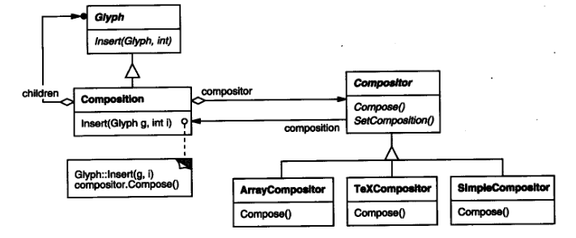

# 实例研究：设计一个文档编辑器

这一章将通过设计一个称为 Lexi 的“所见即所得”（或“ WYSIWYG：What-You-See-Is-What-You-Get”）的文档编辑器，
来介绍设计模式的实际应用。

## 一、设计问题

我们将考察 Lexi 设计中的7个问题：

1.	**文档结构**  对文档内部表示的选择几乎影响 Lexi 设计的每个方面。所有的编辑、格式安排、显示和文本分析都涉及到这种表示。我们怎样组织这个信息会影响到应用的其他方面。
2.	**格式化** Lexi 是怎样将文本和图形安排到行和列上的？哪些对象负责执行不同的格式策略？这些策略又是怎样和内部表述相互作用的？
3.	**修饰用户界面** Lexi 的用户界面包括滚动条、边界和用来修饰WYSIWYG文档界面的阴影。这些修饰有可能随着 Lexi 用户界面的演化而发生变化。因此，在不影响应用其他方面的情况下，能自由增加和去除这些修饰就十分重要了。
4.	**支持多种视感(look-and-feel)标准** Lexi 应不需作较大修改就能适应不同的视感标准，如Motif和PresentationManager(PM)等。
5.	**支持多种窗口系统** 不同的视感标准通常是在不同的窗口系统上实现的。 Lexi 的设计应尽可能的独立于窗口系统。
6.	**用户操作** 用户通过不同的用户界面控制 Lexi ，包括按钮和下拉菜单。这些界面对应的功能分散在整个应用对象中。这里的难点在于提供一个统一的机制，既可以访问这些分散的功能，又可以对操作进行撤消(undo)。
7.	**拼写检查和连字符** Lexi 是怎样支持像检查拼写错误和决定连字符的连字点这样的分析操作的？当我们不得不添加一个新的分析操作时，我们怎样尽量少修改相关的类？

## 二、文档结构

#### 目标

内部表示应支持如下几点：

- 保持文档的物理结构。即将文本和图形安排到行、列、表等。
- 可视化生成和显示文档。
- 根据显示位置来映射文档内部表示的元素。这可以使 L e x i根据用户在可视化表示中所点
  击的某个东西来决定用户所引用的文档元素。

#### 限制条件

1. 我们应该一致对待文本和图形。应用界面允许用户在图形中自由的嵌入文本，反之亦然。我们应该避免将图形看作文本的一种特殊情形，或将文本看作图形的特例。否则，我们最后得到的是冗余的格式和操纵机制。机制集合应该使文本和图形都能满足。
2. 我们的实现不应该过分强调内部表示中单个元素和元素组之间的差别。 Lexi 应该能够一致地对待简单元素和组合元素，这样就允许任意复杂的文档。

### 递归组合

层次结构信息的表述通常是通过一种被称为递归组合(Recursive Composition)的技术来实
现的。

递归组合可以由较简单的元素逐渐建立复杂的元素，是我们通过简单图形元素构造文
档的方法之一。

### 图元

我们将为出现在文档结构中的所有对象定义一个抽象类图元( Glyph )。

它的子类既定义
了基本的图形元素（像字符和图像），又定义了结构元素（像行和列）。

### 组合模式

递归组合不仅可用来表示文档，我们还可以用它表示任何潜在复杂的、层次式的结构。

Composite(4.3)模式描述了面向对象的递归组合的本质。

## 三、格式化

我们将“格式化”含义限制为将一个图元集合分解为若干行。

### 封装格式化算法

理想情况下，我们能够自由地增加一个 Glyph 子类而不用考虑格
式算法。反过来，增加一个格式算法不应要求修改已有的图元类。

### Compositor和Composition

Composition和Compositor类间的关系

### 策略模式

在对象中封装算法是Strategy(5.9)模式的目的。模式的主要参与者是Strategy对象（这些
对象中封装了不同的算法）和它们的操作环境。其实Compositor就是Strategy。它们封装了不
同的格式算法。Composition就是Compositor策略的环境。

Strategy模式应用的关键点在于为Strategy和它的环境设计足够通用的接口，以支持一系
列的算法。你不必为了支持一个新的算法而改变Strategy或它的环境。

## 四、修饰用户界面

我们针对Lexi用户界面考虑两种修饰：

- 第一种是在文本编辑区域周围加边界以界定文本
  页
- 第二种是加滚动条让用户能看到同一页的不同部分

### 透明围栏

透明围栏( Transparent Enclosure) 结合了两个概念： 

1. 单子女（单组件）组合；
2. 兼容的接口。

客户通常分辨不出它们是在处理组件还是组件的围栏
(即，这个组件的父组件)，特别是当围栏只是代理组件的所有操作时更是如此。

### MonoGlyph

我们可以将透明围栏的概念用于所有的修饰其他图元的图元。 

为了使这个概念具体化，我们定义Glyph的子类MonoGlyph作为所有像Border这样“起修饰作用的图元”的抽象类。

MonoGlyph保存了指向一个组件的引用并且传递所有的请求给这个组件。

### Decorator模式

Decorator(4.4)模式描述了以透明围栏来支持修饰的类和对象的关系。

## 五、支持多种视感标准

