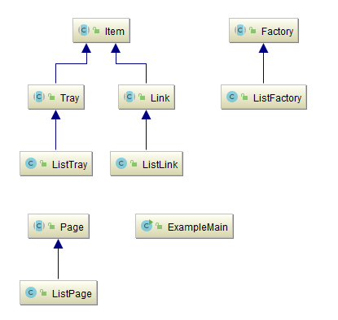
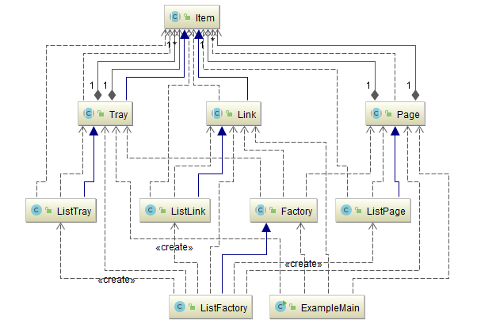
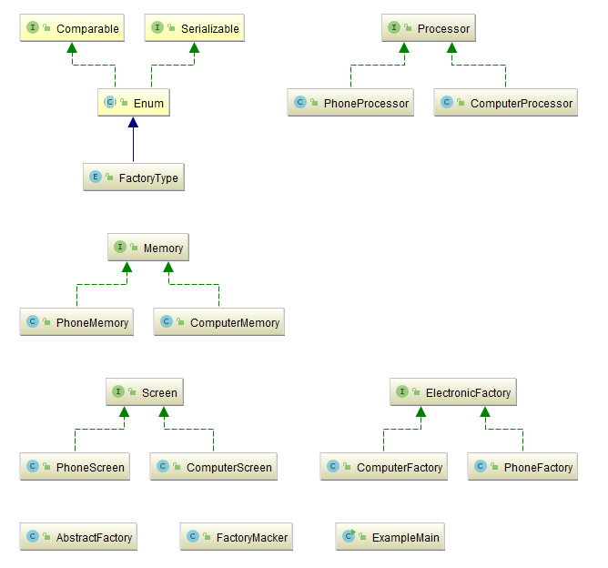
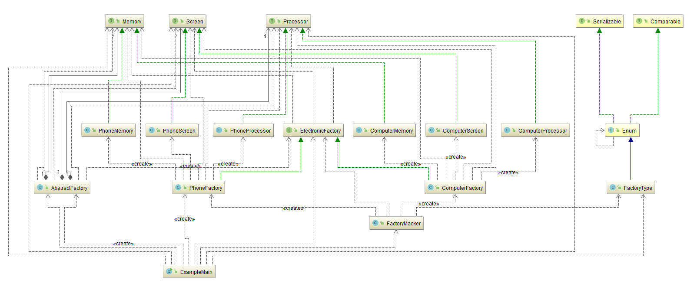

## 抽象工厂（Abstract Factory）

[TOC]

### 意图

提供一个创建一系列相关或相互依赖对象的接口，而无需指定它们具体的类。

### 适用性

在以下情况可以使用Abstract Factory模式：

- 一个系统要独立于它的产品的创建、组合和表示时。
- 一个系统要由多个产品系列中的一个来配置时。
- 当你要强调一系列相关的产品对象的设计以便进行联合使用时。
- 当你提供一个产品类库，而只想显示它们的接口而不是实现时。

### 效果

 Abstract Factory 模式有下面的一些优点和缺点：

1. **它分离了具体的类** Abstract Factory 模式帮助你控制一个应用创建的对象的类。因为一个工厂封装创建产品对象的责任和过程，它将客户与类的实现分离。客户通过它们的抽象接口操纵实例。产品的类名也在具体工厂的实现中被分离；它们不出现在客户代码中。
2. **它使得易于交换产品系列** 一个具体工厂类在一个应用中仅出现一次—即在它初始化
   的时候。这使得改变一个应用的具体工厂变得很容易。它只需改变具体的工厂即可使用不同
   的产品配置，这是因为一个抽象工厂创建了一个完整的产品系列，所以整个产品系列会立刻
   改变。在我们的用户界面的例子中，我们仅需转换到相应的工厂对象并重新创建接口，就可
   实现从Motif窗口组件转换为PresentationManager窗口组件。
3. **它有利于产品的一致性** 当一个系列中的产品对象被设计成一起工作时，一个应用一
   次只能使用同一个系列中的对象，这一点很重要。而 Abstract Factory 很容易实现这一点。
4. **难以支持新种类的产品** 难以扩展抽象工厂以生产新种类的产品。这是因为
    Abstract Factory 接口确定了可以被创建的产品集合。支持新种类的产品就需要扩展该工厂接口，
   这将涉及 Abstract Factory 类及其所有子类的改变。我们会在实现一节讨论这个问题的一个解决
   办法。

### 实现

实现AbstractFactor模式的一些有用技术：

1. **将工厂作为单件** 一个应用中一般每个产品系列只需一个ConcreteFactory的实例。因此工厂通常最好实现为一个Singleton（3.5）。
2. **创建产品** AbstractFactory仅声明一个创建产品的接口，真正创建产品是由ConcreteProduct子类实现的。最通常的一个办法是为每一个产品定义一个工厂方法（参见FactoryMethod（3.3））。一个具体的工厂将为每个产品重定义该工厂方法以指定产品。虽然这样的实现很简单，但它却要求每个产品系列都要有一个新的具体工厂子类，即使这些产品系列的差别很小。
3. **定义可扩展的工厂** AbstractFactory通常为每一种它可以生产的产品定义一个操作。产品的种类被编码在操作型构中。增加一种新的产品要求改变AbstractFactory的接口以及所有与它相关的类。一个更灵活但不太安全的设计是给创建对象的操作增加一个参数。该参数指定了将被创建的对象的种类。它可以是一个类标识符、一个整数、一个字符串，或其他任何可以标识这种产品的东西。

### 示例一：制作HTML文件

将带有层次关系的链接集合制作成HTML文件：

- [部件零件类](AbstractFactory/src/main/java/com/jueee/example01/item)
- [具体的零件实现](AbstractFactory/src/main/java/com/jueee/example01/list)
- [配置零件工厂](AbstractFactory/src/main/java/com/jueee/example01/factory)
- [测试程序](AbstractFactory/src/main/java/com/jueee/example01/ExampleMain.java)

### 示例二：生产一台计算机

假设我们要生产一台计算机（广义的），一台计算机有一些共同的物件。小型计算机（以手机为例）需要有触控屏、微处理器和小型化的内存条。大型计算机（以PC机为例）需要有显示屏、多核处理器和内存条。计算机的各个部件存在着相互依赖关系。

- [部件接口](AbstractFactory/src/main/java/com/jueee/example02/item)
- [手机部件](AbstractFactory/src/main/java/com/jueee/example02/phone)
- [电脑部件](AbstractFactory/src/main/java/com/jueee/example02/computer)
- [电子产品生产工厂](AbstractFactory/src/main/java/com/jueee/example02/factory)
- [测试程序](AbstractFactory/src/main/java/com/jueee/example02/ExampleMain.java)

