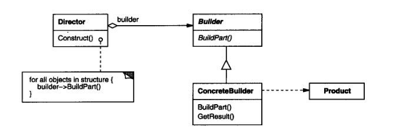
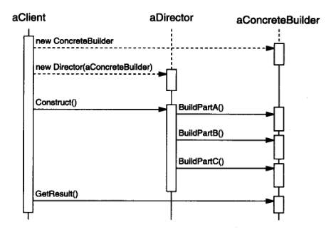

## 生成器（Builder）

[TOC]

### 意图

将一个复杂对象的构建与它的表示分离，使得同样的构建过程可以创建不同的表示。

### 适用性
在以下情况使用 Builder 模式：

- 当创建复杂对象的算法应该独立于该对象的组成部分以及它们的装配方式时。
- 当构造过程必须允许被构造的对象有不同的表示时。

### 结构

Builder 模式结构如下图所示：

### 参与者

##### Builder

- 为创建一个Product对象的各个部件指定抽象接口。

##### ConcreteBuilder

- 实现Builder的接口以构造和装配该产品的各个部件。
- 定义并明确它所创建的表示。
- 提供一个检索产品的接口。

##### Director

- 构造一个使用Builder接口的对象。

##### Product

- 表示被构造的复杂对象。ConcreteBuilder 创建该产品的内部表示并定义它的装配过程。
- 包含定义组成部件的类，包括将这些部件装配成最终产品的接口。

### 协作
-	客户创建Director对象，并用它所想要的Builder对象进行配置。
-	一旦产品部件被生成，导向器就会通知生成器。
-	生成器处理导向器的请求，并将部件添加到该产品中。
-	客户从生成器中检索产品。

下面的交互图说明了Builder和Director是如何与一个客户协作的：

### 效果

Builder模式的主要效果：

- **它使你可以改变一个产品的内部表示** 

  Builder对象提供给导向器一个构造产品的抽象接口。该接口使得生成器可以隐藏这个产品的表示和内部结构。它同时也隐藏了该产品是如何装配的。因为产品是通过抽象接口构造的，你在改变该产品的内部表示时所要做的只是定义一个新的生成器。

- **它将构造代码和表示代码分开**

  Builder模式通过封装一个复杂对象的创建和表示方式提高了对象的模块性。客户不需要知道定义产品内部结构的类的所有信息；这些类是不出现在Builder接口中的。每个ConcreteBuilder包含了创建和装配一个特定产品的所有代码。这些代码只需要写一次；然后不同的Director可以复用它以在相同部件集合的基础上构作不同的Product。

- **它使你可对构造过程进行更精细的控制**

  Builder模式与一下子就生成产品的创建型模式不同，它是在导向者的控制下一步一步构造产品的。仅当该产品完成时导向者才从生成器中取回它。因此Builder接口相比其他创建型模式能更好的反映产品的构造过程。这使你可以更精细的控制构建过程，从而能更精细的控制所得产品的内部结构。

### 实现

通常有一个抽象的Builder类为导向者可能要求创建的每一个构件定义一个操作。

这些操作缺省情况下什么都不做。

一个ConcreteBuilder类对它有兴趣创建的构件重定义这些操作。

- **装配和构造接口**

  生成器逐步的构造它们的产品。因此Builder类接口必须足够普遍，以便为各种类型的具体生成器构造产品。
  一个关键的设计问题在于构造和装配过程的模型。构造请求的结果只是被添加到产品中，通常这样的模型就已足够了。

- **为什么产品没有抽象类**

  通常情况下，由具体生成器生成的产品，它们的表示相差是如此之大以至于给不同的产品以公共父类没有太大意思。
  
- 在**Builder**中却省的方法为空
  
  C++中，生成方法故意不声明为纯虚成员函数，而是把它们定义为空方法，这使客户只重定义他们所感兴趣的操作。

