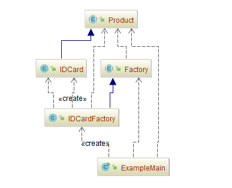

## 工厂方法（Factory Method）

[TOC]

### 意图
定义一个用于创建对象的接口，让子类决定实例化哪一个类。 Factory Method使一个类的实例化延迟到其子类。

### 别名
虚构造器（Virtual Constructor）

### 动机
框架使用抽象类定义和维护对象之间的关系。这些对象的创建通常也由框架负责。

考虑这样一个应用框架，它可以向用户显示多个文档。

在这个框架中，两个主要的抽象是类Application和Document。

这两个类都是抽象的，客户必须通过它们的子类来做与具体应用相关的实现。

例如，为创建一个绘图应用，我们定义类DrawingApplication和DrawingDocument。
Application类负责管理Document并根据需要创建它们—例如，当用户从菜单中选择Open或
New的时候。

因为被实例化的特定Document子类是与特定应用相关的，所以Application类不可能预测到哪个Document子类将被实例化—Application类仅知道一个新的文档何时应被创建，而不
知道哪一种Document将被创建。这就产生了一个尴尬的局面：框架必须实例化类，但是它只
知道不能被实例化的抽象类。

FactoryMethod 模式提供了一个解决办案。它封装了哪一个Document子类将被创建的信
息并将这些信息从该框架中分离出来。

Application的子类重定义Application的抽象操作CreateDocument以返回适当的Document
子类对象。一旦一个Application子类实例化以后，它就可以实例化与应用相关的文档，而无需知道这些文档的类。

我们称CreateDocument是一个工厂方法（Factory Method），因为它负责“生产”一个对象。

### 优点

1. 在工厂方法模式中，工厂方法用来创建客户所需要的产品，同时还向客户隐藏了哪种具体产品类将被实例化这一细节，用户只需要关心所需产品对应的工厂，无须关心创建细节，甚至无须知道具体产品类的类名。
2. 基于工厂角色和产品角色的多态性设计是工厂方法模式的关键。它能够让工厂可以自主确定创建何种产品对象，而如何创建这个对象的细节则完全封装在具体工厂内部。工厂方法模式之所以又被称为多态工厂模式，就正是因为所有的具体工厂类都具有同一抽象父类。
3. 使用工厂方法模式的另一个优点是在系统中加入新产品时，无须修改抽象工厂和抽象产品提供的接口，无须修改客户端，也无须修改其他的具体工厂和具体产品，而只要添加一个具体工厂和具体产品就可以了，这样，系统的可扩展性和灵活性也就变得非常好，维护起来就变得简单了，完全符合“开闭原则（OCP）”。

### 缺点

1. 在添加新产品时，需要编写新的具体产品类，而且还要提供与之对应的具体工厂类，系统中类的个数将成对增加，在一定程度上增加了系统的复杂度，有更多的类需要编译和运行，会给系统带来一些额外的开销。
2. 由于考虑到系统的可扩展性，需要引入抽象层，在客户端代码中均使用抽象层进行定义，增加了系统的抽象性和理解难度，且在实现时可能需要用到反射等技术，增加了系统的实现难度。

### 适用性
在下列情况下可以使用Factory Method模式：

- 当一个类不知道它所必须创建的对象的类的时候。
- 当一个类希望由它的子类来指定它所创建的对象的时候。
- 当类将创建对象的职责委托给多个帮助子类中的某一个，并且你希望将哪一个帮助子类是代理者这一信息局部化的时候。

### 参与者

**Product**（产品）参与者

- 定义工厂方法所创建的对象的接口。

**Concrete Product**（具体产品）参与者

- 实现Product接口。

**Creator**（生产者）参与者

- 声明工厂方法，该方法返回一个Product类型的对象。Creator也可以定义一个工厂方
  法的缺省实现，它返回一个缺省的ConcreteProduct对象。
- 可以调用工厂方法以创建一个Product对象。

**Concrete Creator**（具体生产者）参与者

- 重定义工厂方法以返回一个ConcreteProduct实例。

### 协作
Creator依赖于它的子类来定义工厂方法，所以它返回一个适当的 Concrete Product 实例。

工厂方法不再将与特定应用有关的类绑定到你的代码中。代码仅处理Product接口；因此它可以与用户定义的任何ConcreteProduct类一起使用。

工厂方法的一个潜在缺点在于客户可能仅仅为了创建一个特定的ConcreteProduct对象，就不得不创建Creator的子类。当Creator子类不必需时，客户现在必然要处理类演化的其他方面；但是当客户无论如何必须创建Creator的子类时，创建子类也是可行的。

FactoryMethod模式的另外两种效果：

1. **为子类提供挂钩**（hook）

   用工厂方法在一个类的内部创建对象通常比直接创建对象更灵活。FactoryMethod给子类一个挂钩以提供对象的扩展版本。

2. **连接平行的类层次** 

   工厂方法并不往往只是被Creator调用，客户可以找到一些有用的工厂方法，尤其在平行类层次的情况下。

   当一个类将它的一些职责委托给一个独立的类的时候，就产生了平行类层次。

### 实现
当应用 Factory Method 模式时要考虑下面一些问题：

1. **主要有两种不同的情况** 

   Factory Method 模式主要有两种不同的情况： 

   - 第一种情况是，Creator 类是一个抽象类并且不提供它所声明的工厂方法的实现。 
   - 第二种情况是，Creator 是一个具体的类而且为工厂方法提供一个缺省的实现。也有可能有一个定义了缺省实现的抽象类，但这不太常见。

   第一种情况需要子类来定义实现，因为没有合理的缺省实现。它避免了不得不实例化不可预见类的问题。

   在第二种情况中，具体的 Creator 主要因为灵活性才使用工厂方法。它所遵循的准则是，“用一个独立的操作创建对象，这样子类才能重定义它们的创建方式。”这条准则保证了子类的设计者能够在必要的时候改变父类所实例化的对象的类。

2. **参数化工厂方法** 

   该模式的另一种情况使得工厂方法可以创建多种产品。工厂方法采用一个标识要被创建的对象种类的参数。工厂方法创建的所有对象将共享 Product 接口。

3. **特定语言的变化和问题**

   不同的语言有助于产生其他一些有趣的变化和警告（ caveat）。

4. **使用模板以避免创建子类**

   工厂方法另一个潜在的问题是它们可能仅为了创建适当的Product对象而迫使你创建Creator子类。

5. **命名约定**

   使用命名约定是一个好习惯，它可以清楚地说明你正在使用工厂方法。

### 相关模式
-	Abstract Factory（3.1）经常用工厂方法来实现。 
-	工厂方法通常在Template Methods（5.10）中被调用。
-	Prototypes（3.4）不需要创建Creator的子类。但是，它们通常要求一个针对Product类的Initialize操作。Creator使用Initialize来初始化对象。而FactoryMethod不需要这样的操作。

### 示例一：创建一个身份证，然后使用它

- 创建实例的类 [Factory.java](FactoryMethod/src/main/java/com/jueee/example01/Factory.java)
- 定义具体方法的类 [Product.java](FactoryMethod/src/main/java/com/jueee/example01/Product.java)
- 具体的身份类 [IDCard.java](FactoryMethod/src/main/java/com/jueee/example01/IDCard.java)
- 生产身份证具体的类 [IDCardFactory.java](FactoryMethod/src/main/java/com/jueee/example01/IDCardFactory.java)
- 测试入口 [ExampleMain.java](FactoryMethod/src/main/java/com/jueee/example01/ExampleMain.java)

