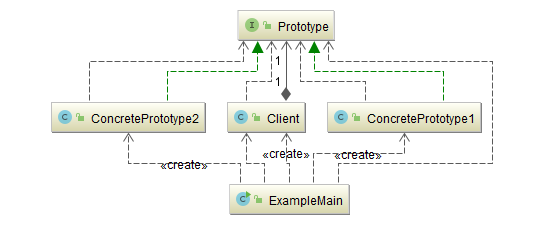
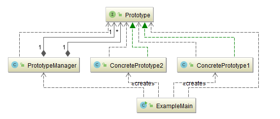
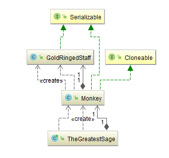

## 原型模式（Prototype）

[TOC]

### 意图
用原型实例指定创建对象的种类，并且通过拷贝这些原型创建新的对象。

### 适用性
- 当一个系统应该独立于它的产品创建、构成和表示时
- 当要实例化的类是在运行时刻指定时，例如，通过动态装载
- 为了避免创建一个与产品类层次平行的工厂类层次时
- 当一个类的实例只能有几个不同状态组合中的一种时。建立相应数目的原型并克隆它们可能比每次用合适的状态手工实例化该类更方便一些。

### 参与者
**Prototype**

声明一个克隆自身的接口。

**ConcretePrototype**

实现一个克隆自身的操作。

**Client**

让一个原型克隆自身从而创建一个新的对象。

### 协作
客户请求一个原型克隆自身。

### 效果

Prototype有许多和AbstractFactory（3.1）和Builder（3.2）一样的效果：它对客户隐藏了具体的产品类，因此减少了客户知道的名字的数目。

此外，这些模式使客户无需改变即可使用与特定应用相关的类。

### 优点

下面列出Prototype模式的另外一些优点：

1. **运行时刻增加和删除产品**

   Prototype允许只通过客户注册原型实例就可以将一个新的具体产品类并入系统。它比其他创建型模式更为灵活，因为客户可以在运行时刻建立和删除原型。

2. **改变值以指定新对象**

   高度动态的系统允许你通过对象复合定义新的行为—例如，通过为一个对象变量指定值—并且不定义新的类。你通过实例化已有类并且将这些实例注册为客户对象的原型，就可以有效定义新类别的对象。客户可以将职责代理给原型，从而表现出新的行为。这种设计使得用户无需编程即可定义新“类”。实际上，克隆一个原型类似于实例化一个类。Prototype模式可以极大的减少系统所需要的类的数目。

3. **改变结构以指定新对象**

   许多应用由部件和子部件来创建对象。为方便起见，这样的应用通常允许你实例化复杂的、用户定义的结构。

4. **减少子类的构造**

   FactoryMethod（3.3）经常产生一个与产品类层次平行的Creator类层次。Prototype模式使得你克隆一个原型而不是请求一个工厂方法去产生一个新的对象。因此你根本不需要Creator类层次。

5. **用类动态配置应用**

   一些运行时刻环境允许你动态将类装载到应用中。一个希望创建动态载入类的实例的应用不能静态引用类的构造器。而应该由运行环境在载入时自动创建每个类的实例，并用原型管理器来注册这个实例。这样应用就可以向原型管理器请求新装载的类的实例，这些类原本并没有和程序相连接。

### 缺点

Prototype的主要缺陷是每一个Prototype的子类都必须实现Clone操作，这可能很困难。

例如，当所考虑的类已经存在时就难以新增Clone操作。

当内部包括一些不支持拷贝或有循环引用的对象时，实现克隆可能也会很困难的。

### 实现

当实现原型时，要考虑下面一些问题：

1. **使用一个原型管理器**

   当一个系统中原型数目不固定时（也就是说，它们可以动态创建和销毁），要保持一个可用原型的注册表。

   客户不会自己来管理原型，但会在注册表中存储和检索原型。

   客户在克隆一个原型前会向注册表请求该原型。我们称这个注册表为原型管理器（prototypemanager）。

   原型管理器是一个关联存储器（associativestore），它返回一个与给定关键字相匹配的原型。它有一些操作可以用来通过关键字注册原型和解除注册。客户可以在运行时更改甚或浏览这个注册表。这使得客户无需编写代码就可以扩展并得到系统清单。

2. **实现克隆操作**

   Prototype模式最困难的部分在于正确实现Clone操作。当对象结构包含循环引用时，这尤为棘手。大多数语言都对克隆对象提供了一些支持。浅拷贝简单并且通常也足够了，但克隆一个结构复杂的原型通常需要深拷贝，因为复制对象和原对象必须相互独立。因此你必须保证克隆对象的构件也是对原型的构件的克隆。克隆迫使你决定如果所有东西都被共享了该怎么办。如果系统中的对象提供了Save和Load操作，那么你只需通过保存对象和立刻载入对象，就可以为Clone操作提供一个缺省实现。Save操作将该对象保存在内存缓冲区中，而Load则通过从该缓冲区中重构这个对象来创建一个复本。

3. **初始化克隆对象**

   当一些客户对克隆对象已经相当满意时，另一些客户将会希望使用他们所选择的一些值来初始化该对象的一些或是所有的内部状态。

   一般来说不可能在Clone操作中传递这些值，因为这些值的数目由于原型的类的不同而会有所不同。

   在Clone操作中传递参数会破坏克隆接口的统一性。

### Java中的克隆方法

Java的所有类都是从java.lang.Object类继承而来的，而Object类提供protected Object clone()方法对对象进行复制，子类当然也可以把这个方法置换掉，提供满足自己需要的复制方法。

对象的复制有一个基本问题，就是对象通常都有对其他的对象的引用。当使用Object类的clone()方法来复制一个对象时，此对象对其他对象的引用也同时会被复制一份。

#### 克隆满足的条件

clone()方法将对象复制了一份并返还给调用者。所谓“复制”的含义与clone()方法是怎么实现的。

一般而言，clone()方法满足以下的描述：

1. 对任何的对象x，都有：x.clone()!=x。换言之，克隆对象与原对象不是同一个对象。
2. 对任何的对象x，都有：x.clone().getClass() == x.getClass()，换言之，克隆对象与原对象的类型一样。
3. 如果对象x的equals()方法定义其恰当的话，那么x.clone().equals(x)应当成立的。

在JAVA语言的API中，凡是提供了clone()方法的类，都满足上面的这些条件。

一般来说，上面的三个条件中的前两个是必需的，而第三个是可选的。

#### **浅克隆和深克隆**

无论你是自己实现克隆方法，还是采用Java提供的克隆方法，都存在一个浅度克隆和深度克隆的问题。

##### **浅度克隆**

只负责克隆按值传递的数据（比如基本数据类型、String类型），而不复制它所引用的对象，换言之，所有的对其他对象的引用都仍然指向原来的对象。

##### **深度克隆**

除了浅度克隆要克隆的值外，还负责克隆引用类型的数据。那些引用其他对象的变量将指向被复制过的新对象，而不再是原有的那些被引用的对象。

换言之，深度克隆把要复制的对象所引用的对象都复制了一遍，而这种对被引用到的对象的复制叫做间接复制。

#### 利用序列化实现深度克隆

把对象写到流里的过程是序列化(Serialization)过程；而把对象从流中读出来的过程则叫反序列化(Deserialization)过程。

应当指出的是，写到流里的是对象的一个拷贝，而原对象仍然存在于JVM里面。

在Java语言里深度克隆一个对象，常常可以先使对象实现Serializable接口，然后把对象（实际上只是对象的拷贝）写到一个流里（序列化），再从流里读回来（反序列化），便可以重建对象。

```java
public  Object deepClone() throws IOException, ClassNotFoundException{
    //将对象写到流里
    ByteArrayOutputStream bos = new ByteArrayOutputStream();
    ObjectOutputStream oos = new ObjectOutputStream(bos);
    oos.writeObject(this);
    //从流里读回来
    ByteArrayInputStream bis = new ByteArrayInputStream(bos.toByteArray());
    ObjectInputStream ois = new ObjectInputStream(bis);
    return ois.readObject();
}
```

这样做的前提就是对象以及对象内部所有引用到的对象都是**可序列化**的，否则，就需要仔细考察那些不可序列化的对象可否设成transient，从而将之排除在复制过程之外。

### 示例一：简单形式的原型模式

这种形式涉及到三个角色：

1. **客户（Client）角色**：[ExampleMain](Pattern34_Prototype/src/main/java/com/jueee/example01/ExampleMain.java)

   客户类提出创建对象的请求。

2. **抽象原型（Prototype）角色**：[Prototype](Pattern34_Prototype/src/main/java/com/jueee/example01/Prototype.java)

   这是一个抽象角色，通常由一个Java接口或Java抽象类实现。此角色给出所有的具体原型类所需的接口。

3. **具体原型（Concrete Prototype）角色**：[ConcretePrototype1](Pattern34_Prototype/src/main/java/com/jueee/example01/ConcretePrototype1.java)   [ConcretePrototype2](Pattern34_Prototype/src/main/java/com/jueee/example01/ConcretePrototype2.java)

   被复制的对象。此角色需要实现抽象的原型角色所要求的接口。



### 示例二：登记形式的原型模式

这种形式涉及到四个角色：

1. **客户（Client）角色**：[ExampleMain](Pattern34_Prototype/src/main/java/com/jueee/example02/ExampleMain.java)

   客户类提出创建对象的请求。

2. **抽象原型（Prototype）角色**：[Prototype](Pattern34_Prototype/src/main/java/com/jueee/example02/Prototype.java)

   这是一个抽象角色，通常由一个Java接口或Java抽象类实现。此角色给出所有的具体原型类所需的接口。

3. **具体原型（Concrete Prototype）角色**：[ConcretePrototype1](Pattern34_Prototype/src/main/java/com/jueee/example02/ConcretePrototype1.java)   [ConcretePrototype2](Pattern34_Prototype/src/main/java/com/jueee/example02/ConcretePrototype2.java)

   被复制的对象。此角色需要实现抽象的原型角色所要求的接口。

4. **原型管理器（PrototypeManager）角色**：[PrototypeManager](Pattern34_Prototype/src/main/java/com/jueee/example02/PrototypeManager.java)

   创建具体原型类的对象，并记录每一个被创建的对象。



### 示例三：浅度克隆

[浅度克隆代码](Pattern34_Prototype/src/main/java/com/jueee/example03)

- 复制的大圣本尊具有和原始的大圣本尊对象一样的属性，而本尊对象不相等，二者是克隆关系
- 复制的大圣本尊所持有的金箍棒和原始的大圣本尊所持有的金箍棒为同一个对象。


### 示例四：深度克隆

[深度克隆代码](Pattern34_Prototype/src/main/java/com/jueee/example04)

为做到**深度克隆**，所有需要复制的对象都需要实现`java.io.Serializable`接口。

在大圣本尊对象被序列化和反序列化时，它所持有的金箍棒对象也同时被序列化和反序列化，这使得复制的大圣的金箍棒和原大圣本尊对象所持有的金箍棒对象是两个独立的对象。



