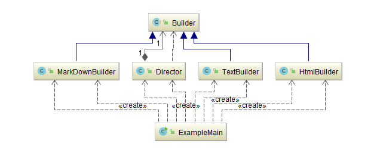
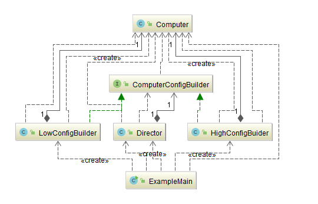
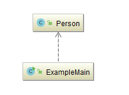

## 生成器（Builder）

### 示例一：以不同方式生成列表

- [文本](src/main/java/com/jueee/example01/TextBuilder.java)
- [Html](src/main/java/com/jueee/example01/HtmlBuilder.java)
- [Markdown](src/main/java/com/jueee/example01/MarkDownBuilder.java)
- [测试入口](src/main/java/com/jueee/example01/ExampleMain.java)

### 示例二：模拟电脑的生产或者组装

经典Buider模式中有四个角色：

1. 要建造的产品Product -- 组装的电脑 [Computer.java](src/main/java/com/jueee/example02/Computer.java)
2. 抽象的Builder -- 装CPU、内存条、硬盘等抽象的步骤 [ComputerConfigBuilder.java](src/main/java/com/jueee/example02/ComputerConfigBuilder.java)
3. Builder的具体实现ConcreteBuilder -- 对上述抽象步骤的实现，比如装i5CPU、8G内存条、1T硬盘
   - 低配版的套餐：[LowConfigBuilder.java](src/main/java/com/jueee/example02/LowConfigBuilder.java)
   - 高配版的套餐：[HighConfigBuider.java](src/main/java/com/jueee/example02/HighConfigBuider.java)
4. 使用者Director -- 电脑装机人员 [Director.java](src/main/java/com/jueee/example02/Director.java)
5. 测试入口 [ExampleMain.java](src/main/java/com/jueee/example02/ExampleMain.java)

### 示例三：创建一个不可变的Person对象，其中名字和性别是必须的

由于这个Person对象是不可变的，所以毫无疑问我们给他的所有属性都加了final修饰，当然如果没有不可变的需求也是可以不加的，然后在Person类中定义一个内部类Builder，这个Builder内部类中的属性要和Person中的相同，并且必须有的属性要用final修饰，防止这些属性没有被赋值，其他非必须的属性不能用final，因为如果加了final，就必须对其进行初始化，这样这些非必须的属性又变成必须的。然后内部类中定义了一个构造方法，传入必须有的属性。其他非必须的属性都通过方法设置，每个方法都返回Builder对象自身。最后定义了一个build方法，将Builder对象传入Person的私有构造方法，最终返回一个对象。

- [Person.java](src/main/java/com/jueee/example03/Person.java)
- [测试入口](src/main/java/com/jueee/example03/ExampleMain.java)

