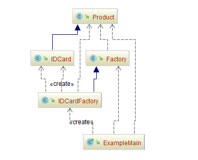

## 工厂方法（Factory Method）

### 示例一：创建一个身份证，然后使用它

- 创建实例的类 [Factory.java](src/main/java/com/jueee/example01/Factory.java)
- 定义具体方法的类 [Product.java](src/main/java/com/jueee/example01/Product.java)
- 具体的身份类 [IDCard.java](src/main/java/com/jueee/example01/IDCard.java)
- 生产身份证具体的类 [IDCardFactory.java](src/main/java/com/jueee/example01/IDCardFactory.java)
- 测试入口 [ExampleMain.java](src/main/java/com/jueee/example01/ExampleMain.java)

