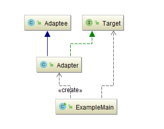
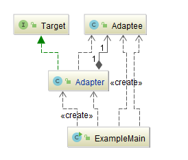

## 适配器模式（Adapter Pattern）

### 意图
将一个类的接口转换成客户希望的另外一个接口。

Adapter 模式使得原本由于接口不兼容而不能一起工作的那些类可以一起工作。

### 适用性

以下情况使用 Adapter 模式：

- 你想使用一个已经存在的类，而它的接口不符合你的需求。
- 你想创建一个可以复用的类，该类可以与其他不相关的类或不可预见的类（即那些接口可能不一定兼容的类）协同工作。
- （仅适用于对象Adapter ）你想使用一些已经存在的子类，但是不可能对每一个都进行子类化以匹配它们的接口。对象适配器可以适配它的父类接口。

### 参与者
-	**Target**

定义Client使用的与特定领域相关的接口。

-	**Client**

与符合Target接口的对象协同。

-	**Adaptee**

定义一个已经存在的接口，这个接口需要适配。

-	**Adapter**

对Adaptee的接口与Target接口进行适配。

### 协作
lient在Adapter实例上调用一些操作。接着适配器调用Adaptee的操作实现这个请求。

### 效果

类适配器和对象适配器有不同的权衡。

#### 类适配器

- 用一个具体的Adapter类对Adaptee和Target进行匹配。结果是当我们想要匹配一个类以及所有它的子类时，类Adapter将不能胜任工作。
- 使得Adapter可以重定义Adaptee的部分行为，因为Adapter是Adaptee的一个子类。
- 仅仅引入了一个对象，并不需要额外的指针以间接得到Adaptee。

#### 对象适配器

- 允许一个Adapter与多个Adaptee—即Adaptee本身以及它的所有子类（如果有子类的话）同时工作。Adapter也可以一次给所有的Adaptee添加功能。
- 使得重定义Adaptee的行为比较困难。这就需要生成Adaptee的子类并且使得Adapter引用这个子类而不是引用Adaptee本身。

### 考虑的其他因素

1. **Adapter 的匹配程度**

   对Adaptee的接口与Target的接口进行匹配的工作量各个Adapter可能不一样。工作范围可能是，从简单的接口转换(例如改变操作名)到支持完全不同的操作集合。Adapter的工作量取决于Target接口与Adaptee接口的相似程度。

2. **可插入的 Adapter**

   当其他的类使用一个类时，如果所需的假定条件越少，这个类就更具可复用性。如果将接口匹配构建为一个类，就不需要假定对其他的类可见的是一个相同的接口。也就是说，接口匹配使得我们可以将自己的类加入到一些现有的系统中去，而这些系统对这个类的接口可能会有所不同。

3. **使用双向适配器提供透明操作**

   使用适配器的一个潜在问题是，它们不对所有的客户都透明。被适配的对象不再兼容Adaptee的接口，因此并不是所有Adaptee对象可以被使用的地方它都可以被使用。双向适配器提供了这样的透明性。在两个不同的客户需要用不同的方式查看同一个对象时，双向适配器尤其有用。

### 适配器模式的优点

- **更好的复用性**

  系统需要使用现有的类，而此类的接口不符合系统的需要。那么通过适配器模式就可以让这些功能得到更好的复用。

- **更好的扩展性**

  在实现适配器功能的时候，可以调用自己开发的功能，从而自然地扩展系统的功能。

### 适配器模式的缺点

过多的使用适配器，会让系统非常零乱，不易整体进行把握。

比如，明明看到调用的是A接口，其实内部被适配成了B接口的实现，一个系统如果太多出现这种情况，无异于一场灾难。

因此如果不是很有必要，可以不使用适配器，而是直接对系统进行重构。

### 示例一：类适配器模式

- **[Target.java](Pattern41_Adapter/src/main/java/com/jueee/example01/Target.java)**：

  定义Client使用的与特定领域相关的接口。

- **[Adaptee.java](Pattern41_Adapter/src/main/java/com/jueee/example01/Adaptee.java)**：

  定义一个已经存在的接口，这个接口需要适配。

- **[Adapter.java](Pattern41_Adapter/src/main/java/com/jueee/example01/Adapter.java)**：

  对Adaptee的接口与Target接口进行适配。

- **[ExampleMain.java](Pattern41_Adapter/src/main/java/com/jueee/example01/ExampleMain.java)**：

  与符合Target接口的对象协同。

### 示例二：对象适配器模式

- **[Target.java](Pattern41_Adapter/src/main/java/com/jueee/example02/Target.java)**：

  定义Client使用的与特定领域相关的接口。

- **[Adaptee.java](Pattern41_Adapter/src/main/java/com/jueee/example02/Adaptee.java)**：

  定义一个已经存在的接口，这个接口需要适配。

- **[Adapter.java](Pattern41_Adapter/src/main/java/com/jueee/example02/Adapter.java)**：

  对Adaptee的接口与Target接口进行适配。

- **[ExampleMain.java](Pattern41_Adapter/src/main/java/com/jueee/example02/ExampleMain.java)**：

  与符合Target接口的对象协同。

