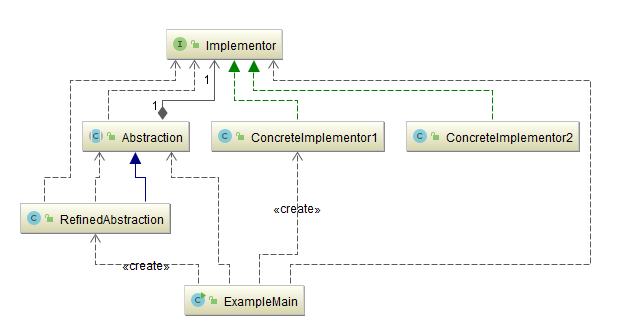
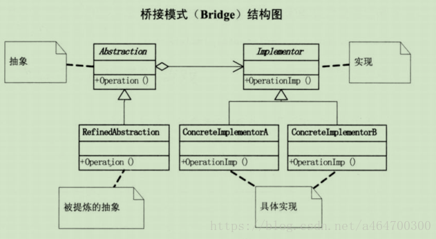
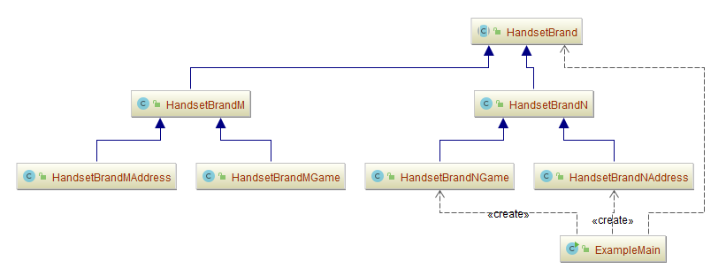
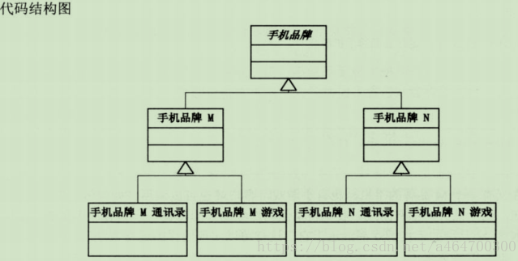
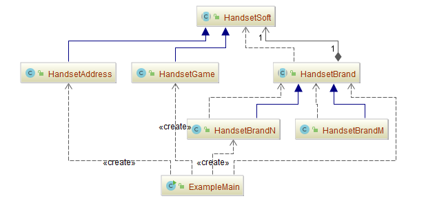
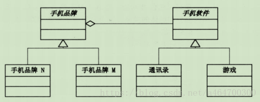
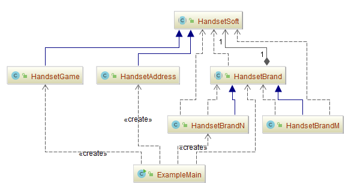

## 桥接模式（Bridge Pattern）

### 意图
将抽象部分与它的实现部分分离，使它们都可以独立地变化。

### 动机
当一个抽象可能有多个实现时，通常用继承来协调它们。抽象类定义对该抽象的接口，而具体的子类则用不同方式加以实现。

但是此方法有时不够灵活。继承机制将抽象部分与它的实现部分固定在一起，使得难以对抽象部分和实现部分独立地进行修改、扩充和重用。

### 适用性
以下一些情况使用Bridge模式:
-	你不希望在抽象和它的实现部分之间有一个固定的绑定关系。例如这种情况可能是因为，在程序运行时刻实现部分应可以被选择或者切换。
-	类的抽象以及它的实现都应该可以通过生成子类的方法加以扩充。这时Bridge模式使你可以对不同的抽象接口和实现部分进行组合，并分别对它们进行扩充。
-	对一个抽象的实现部分的修改应对客户不产生影响，即客户的代码不必重新编译。
-	（C++）你想对客户完全隐藏抽象的实现部分。在C++中，类的表示在类接口中是可见的。
-	你想在多个对象间共享实现（可能使用引用计数），但同时要求客户并不知道这一点。

### 参与者
- **Abstraction**

  定义抽象类的接口。
  维护一个指向Implementor类型对象的指针。

- **RefinedAbstraction**

  扩充由Abstraction定义的接口。

- **Implementor**

  定义实现类的接口，该接口不一定要与Abstraction的接口完全一致；事实上这两个
  接口可以完全不同。

  一般来讲，Implementor接口仅提供基本操作，而Abstraction则定义了基于这些基本操作的较高层次的操作。

- **ConcreteImplementor**

  实现Implementor接口并定义它的具体实现。

### 协作

Abstraction将client的请求转发给它的Implementor对象。

### 优点

- **抽象和实现分离**

  这也是桥梁模式的主要特点，它完全是为了解决继承的缺点而提出的设计模式。在该模式下，实现可以不受抽象的约束，不用再绑定在一个固定的抽象层次上。

- **优秀的扩充能力**

  想增加实现？没问题！想增加抽象，也没有问题！只要对外暴露的接口层允许这样的变化，我们已经把变化的可能性减到最小。

- **实现细节对客户透明**

  客户不用关心细节的实现，它已经由抽象层通过聚合关系完成了封装。

### 使用场景

- **不希望或不适用使用继承的场景**

  例如继承层次过渡、无法更细化设计颗粒等场景，需要考虑使用桥梁模式。

- **接口或抽象类不稳定的场景**

  明知道接口不稳定还想通过实现或继承来实现业务需求，那是得不偿失的，也是比较失败的做法。

- **重用性要求较高的场景**

  设计的颗粒度越细，则被重用的可能性就越大，而采用继承则受父类的限制，不可能出
  现太细的颗粒度。

### 效果
Bridge模式有以下一些优点：

1. **分离接口及其实现部分**

   一个实现未必不变地绑定在一个接口上。抽象类的实现可以在运行时刻进行配置，一个对象甚至可以在运行时刻改变它的实现。

   将Abstraction与Implementor分离有助于降低对实现部分编译时刻的依赖性，当改变一个实现类时，并不需要重新编译Abstraction类和它的客户程序。为了保证一个类库的不同版本之间的二进制兼容性，一定要有这个性质。

   另外，接口与实现分离有助于分层，从而产生更好的结构化系统，系统的高层部分仅需知道Abstraction和Implementor即可。

2. **提高可扩充性**

   你可以独立地对Abstraction和Implementor层次结构进行扩充。

3. **实现细节对客户透明**

   你可以对客户隐藏实现细节，例如共享Implementor对象以及相应的引用计数机制（如果有的话）。

### 示例一：通用源代码

- Abstraction——抽象化角色：[Abstraction.java](Pattern42_Bridge/src/main/java/com/jueee/example01/Abstraction.java)

  它的主要职责是定义出该角色的行为，同时保存一个对实现化角色的引用，该角色一般是抽象类。

- Implementor——实现化角色：[Implementor.java](Pattern42_Bridge/src/main/java/com/jueee/example01/Implementor.java)

  它是接口或者抽象类，定义角色必需的行为和属性。

- Refined Abstraction——修正抽象化角色：[RefinedAbstraction.java](Pattern42_Bridge/src/main/java/com/jueee/example01/RefinedAbstraction.java)

  它引用实现化角色对抽象化角色进行修正。

- Concrete Implementor——具体实现化角色[ConcreteImplementor1.java](Pattern42_Bridge/src/main/java/com/jueee/example01/ConcreteImplementor1.java)
  [ConcreteImplementor2.java](Pattern42_Bridge/src/main/java/com/jueee/example01/ConcreteImplementor2.java)

  它实现接口或抽象类定义的方法和属性。

-	测试类：[ExampleMain.java](Pattern42_Bridge/src/main/java/com/jueee/example01/ExampleMain.java)

### 示例二：手机品牌之紧耦合程序

-	[ExampleMain.java](Pattern42_Bridge/src/main/java/com/jueee/example02/ExampleMain.java)
-	[HandsetBrand.java](Pattern42_Bridge/src/main/java/com/jueee/example02/HandsetBrand.java)
-	[HandsetBrandM.java](Pattern42_Bridge/src/main/java/com/jueee/example02/HandsetBrandM.java)
-	[HandsetBrandMAddress.java](Pattern42_Bridge/src/main/java/com/jueee/example02/HandsetBrandMAddress.java)
-	[HandsetBrandMGame.java](Pattern42_Bridge/src/main/java/com/jueee/example02/HandsetBrandMGame.java)
-	[HandsetBrandN.java](Pattern42_Bridge/src/main/java/com/jueee/example02/HandsetBrandN.java)
-	[HandsetBrandNAddress.java](Pattern42_Bridge/src/main/java/com/jueee/example02/HandsetBrandNAddress.java)
-	[HandsetBrandNGame.java](Pattern42_Bridge/src/main/java/com/jueee/example02/HandsetBrandNGame.java)

### 示例三：手机品牌之松耦合程序

-	[ExampleMain.java](Pattern42_Bridge/src/main/java/com/jueee/example03/ExampleMain.java)
-	[HandsetAddress.java](Pattern42_Bridge/src/main/java/com/jueee/example03/HandsetAddress.java)
-	[HandsetBrand.java](Pattern42_Bridge/src/main/java/com/jueee/example03/HandsetBrand.java)
-	[HandsetBrandM.java](Pattern42_Bridge/src/main/java/com/jueee/example03/HandsetBrandM.java)
-	[HandsetBrandN.java](Pattern42_Bridge/src/main/java/com/jueee/example03/HandsetBrandN.java)
-	[HandsetGame.java](Pattern42_Bridge/src/main/java/com/jueee/example03/HandsetGame.java)
-	[HandsetSoft.java](Pattern42_Bridge/src/main/java/com/jueee/example03/HandsetSoft.java)

### 示例四：手机品牌之桥接模式

-	[ExampleMain.java](Pattern42_Bridge/src/main/java/com/jueee/example04/ExampleMain.java)
-	[HandsetAddress.java](Pattern42_Bridge/src/main/java/com/jueee/example04/HandsetAddress.java)
-	[HandsetBrand.java](Pattern42_Bridge/src/main/java/com/jueee/example04/HandsetBrand.java)
-	[HandsetBrandM.java](Pattern42_Bridge/src/main/java/com/jueee/example04/HandsetBrandM.java)
-	[HandsetBrandN.java](Pattern42_Bridge/src/main/java/com/jueee/example04/HandsetBrandN.java)
-	[HandsetGame.java](Pattern42_Bridge/src/main/java/com/jueee/example04/HandsetGame.java)
-	[HandsetSoft.java](Pattern42_Bridge/src/main/java/com/jueee/example04/HandsetSoft.java)

