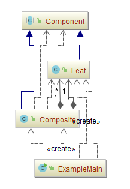
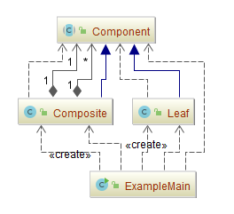

## 组合模式（Composite）

### 意图
将对象组合成树形结构以表示“**部分-整体**”的层次结构。

Composite 使得用户对单个对象和组合对象的使用具有一致性。

### 适用性
以下情况使用 Composite 模式:
-	你想表示对象的部分-整体层次结构。
-	你希望用户忽略组合对象与单个对象的不同，用户将统一地使用组合结构中的所有对象。

### 参与者
-	**Component**：组件对象
	-	为组合中的对象声明接口。
	-	在适当的情况下，实现所有类共有接口的缺省行为。
	-	声明一个接口用于访问和管理Composite 的子组件。
	-	(可选)在递归结构中定义一个接口，用于访问一个父部件，并在合适的情况下实现它。
-	**Leaf**：叶子对象
	-	在组合中表示叶节点对象，叶节点没有子节点。
	-	在组合中定义图元对象的行为。
-	**Composite**：组合对象
	-	定义有子部件的那些部件的行为。
	-	存储子部件。
	-	在Composite 接口中实现与子部件有关的操作。
-	**Client**：客户端
	-	通过Composite 接口操纵组合部件的对象。

### 协作
用户使用Component类接口与组合结构中的对象进行交互：

- 如果接收者是一个叶节点，则直接处理请求。
- 如果接收者是Composite，它通常将请求发送给它的子部件，在转发请求之前与/或之后可能执行一些辅助操作。

### 效果
- **定义了包含基本对象和组合对象的类层次结构**

  基本对象可以被组合成更复杂的组合对象，而这个组合对象又可以被组合，这样不断的递归下去。客户代码中，任何用到基本对象的地方都可以使用组合对象。

- **简化客户代码**

  客户可以一致地使用组合结构和单个对象。通常用户不知道(也不关心)处理的是一个叶节点还是一个组合组件。这就简化了客户代码,因为在定义组合的那些类中不需要写一些充斥着选择语句的函数。

- **使得更容易增加新类型的组件**

  新定义的Composite或Leaf子类自动地与已有的结构和客户代码一起工作，客户程序不需因新的Component类而改变。

- **使你的设计变得更加一般化**

  容易增加新组件也会产生一些问题，那就是很难限制组合中的组件。有时你希望一个组合只能有某些特定的组件。使用Composite时，你不能依赖类型系统施加这些约束，而必须在运行时刻进行检查。

### 示例一：商品类别树的管理

-	**[Component.java](CompositePattern/src/main/java/com/jueee/example01/Component.java)**：组件对象
-	**[Leaf.java](CompositePattern/src/main/java/com/jueee/example01/Leaf.java)**：叶子对象
-	**[Composite.java](CompositePattern/src/main/java/com/jueee/example01/Composite.java)**：组合对象
-	**[ExampleMain.java](CompositePattern/src/main/java/com/jueee/example01/ExampleMain.java)**：客户端

输出结果：

```
+服装
	+男装
		-衬衣
		-夹克
	+女装
		-裙子
		-套装
```



### 示例二：打印目录结构

- **[Component.java](CompositePattern/src/main/java/com/jueee/example02/Component.java)**：组件对象
- **[Leaf.java](CompositePattern/src/main/java/com/jueee/example02/Leaf.java)**：叶子对象
- **[Composite.java](CompositePattern/src/main/java/com/jueee/example02/Composite.java)**：组合对象
- **[ExampleMain.java](CompositePattern/src/main/java/com/jueee/example02/ExampleMain.java)**：客户端



