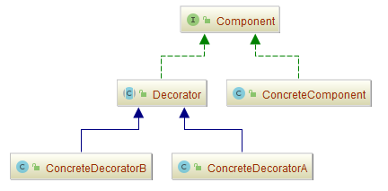
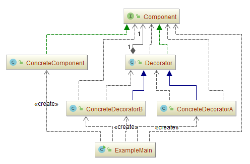
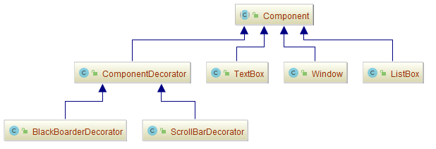
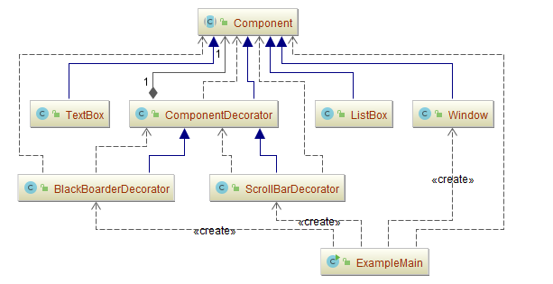
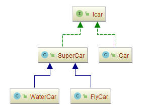
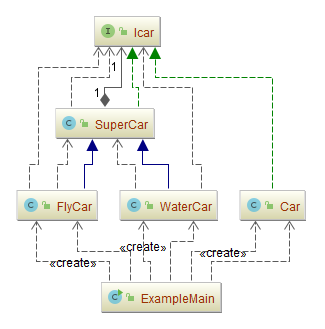
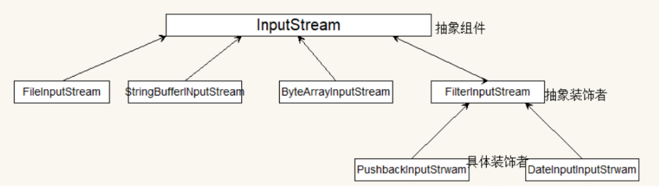

## 装饰模式（Decorator）

### 意图
动态地给一个对象添加一些额外的职责。

就增加功能来说，Decorator模式相比生成子类更为灵活。

### 适用性

-	在不影响其他对象的情况下，以动态、透明的方式给单个对象添加职责。
-	处理那些可以撤消的职责。
-	当不能采用生成子类的方法进行扩充时。
  - 情况一：可能有大量独立的扩展，为支持每一种组合将产生大量的子类，使得子类数目呈爆炸性增长。
  - 情况二：可能是因为类定义被隐藏，或类定义不能用于生成子类。

### 参与者
- **Component**：抽象构件角色

  定义一个对象接口，可以给这些对象动态地添加职责。

- **ConcreteComponent**：具体构件角色（真实对象）

  定义一个对象，可以给这个对象添加一些职责。

- **Decorator**：装饰角色

  维持一个指向Component对象的指针，并定义一个与Component接口一致的接口。

-	**ConcreteDecorator**：具体装饰角色

向组件添加职责。

### 协作

Decorator将请求转发给它的Component对象，并有可能在转发请求前后执行一些附加的动作。

### 优点

- 扩展对象功能，比继承灵活，不会导致类个数急剧增加。
- 可以对一个对象进行多次装饰，创造出不同行为的组合，得到功能更加强大的对象。
- 具体构建类和具体装饰类可以独立变化，用户可以根据需要自己增加新的具体构建子类和具体装饰子类。

### 缺点
- 产生很多小对象，大量小对象占据内存，一定程度影响性能。
- 装饰模式易于出错，调试排查比较麻烦。

### 实现
使用Decorator模式时应注意以下几点：
- **接口的一致性**

  装饰对象的接口必须与它所装饰的Component的接口是一致的，因此，所有的ConcreteDecorator类必须有一个公共的父类。

- **省略抽象的Decorator类**

  当你仅需要添加一个职责时，没有必要定义抽象Decorator类。

- **保持Component类的简单性**

  为了保证接口的一致性，组件和装饰必须有一个公共的Component父类。因此保持这个类的简单性是很重要的；即，它应集中于定义接口而不是存储数据。对数据表示的定义应延迟到子类中，否则Component类会变得过于复杂和庞大，因而难以大量使用。赋予Component太多的功能也使得，具体的子类有一些它们并不需要的功能的可能性大大增加。

- **改变对象外壳与改变对象内核**

  我们可以将Decorator看作一个对象的外壳，它可以改变这个对象的行为。另外一种方法是改变对象的内核。

### 示例一：通用源代码

- **[Component.java](Pattern44_Decorator/src/main/java/com/jueee/example01/Component.java)**：抽象构件角色
- **[ConcreteComponent.java](Pattern44_Decorator/src/main/java/com/jueee/example01/ConcreteComponent.java)**：具体构件角色（真实对象）
- **[Decorator.java](Pattern44_Decorator/src/main/java/com/jueee/example01/Decorator.java)**：装饰角色
- **[ConcreteDecoratorA.java](Pattern44_Decorator/src/main/java/com/jueee/example01/ConcreteDecoratorA.java)**、**[ConcreteDecoratorB.java](Pattern44_Decorator/src/main/java/com/jueee/example01/ConcreteDecoratorB.java)**：具体装饰角色
- **[ExampleMain.java](Pattern44_Decorator/src/main/java/com/jueee/example01/ExampleMain.java)**：测试类

### 示例二：窗体装饰

- [Component.java](Pattern44_Decorator/src/main/java/com/jueee/example02/Component.java)：抽象构件角色
- [ListBox.java](Pattern44_Decorator/src/main/java/com/jueee/example02/ListBox.java)、[TextBox.java](Pattern44_Decorator/src/main/java/com/jueee/example02/TextBox.java)、[Window.java](Pattern44_Decorator/src/main/java/com/jueee/example02/Window.java)：具体构件角色（真实对象）
- [ComponentDecorator.java](Pattern44_Decorator/src/main/java/com/jueee/example02/ComponentDecorator.java)：装饰角色
- [ScrollBarDecorator.java](Pattern44_Decorator/src/main/java/com/jueee/example02/ScrollBarDecorator.java)、[ComponentDecorator.java](Pattern44_Decorator/src/main/java/com/jueee/example02/ComponentDecorator.java)：具体装饰角色
- [ExampleMain.java](Pattern44_Decorator/src/main/java/com/jueee/example02/ExampleMain.java)：测试类

### 示例三：给汽车新增功能

- [Icar.java](Pattern44_Decorator/src/main/java/com/jueee/example03/Icar.java)：抽象构件角色
- [Car.java](Pattern44_Decorator/src/main/java/com/jueee/example03/Car.java)：具体构件角色（真实对象）
- [SuperCar.java](Pattern44_Decorator/src/main/java/com/jueee/example03/SuperCar.java)：装饰角色
- [FlyCar.java](Pattern44_Decorator/src/main/java/com/jueee/example03/FlyCar.java)、[WaterCar.java](Pattern44_Decorator/src/main/java/com/jueee/example03/WaterCar.java)：具体装饰角色
- [ExampleMain.java](Pattern44_Decorator/src/main/java/com/jueee/example03/ExampleMain.java)：测试类

### 经典示例：典型的装饰者I/O

java.io 包内的类很多都是装饰者：

