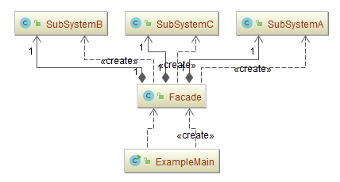
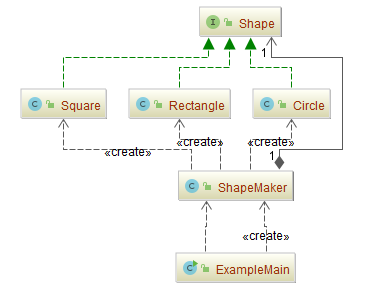

## 外观模式（Facade）

### 意图
为子系统中的一组接口提供一个一致的界面， Facade 模式定义了一个高层接口，这个接口使得这一子系统更加容易使用。

### 动机
将一个系统划分成为若干个子系统有利于降低系统的复杂性。

一个常见的设计目标是使子系统间的通信和相互依赖关系达到最小。

达到该目标的途径之一是就是引入一个外观（Facade）对象，它为子系统中较一般的设施提供了一个单一而简单的界面。

### 适用性
- 当你要为一个复杂子系统提供一个简单接口时。

  子系统往往因为不断演化而变得越来越复杂。大多数模式使用时都会产生更多更小的类。

  这使得子系统更具可重用性，也更容易对子系统进行定制，但这也给那些不需要定制子系统的用户带来一些使用上的困难。

  Facade可以提供一个简单的缺省视图，这一视图对大多数用户来说已经足够，而那些需要更多的可定制性的用户可以越过facade层。

- 客户程序与抽象类的实现部分之间存在着很大的依赖性。

  引入facade将这个子系统与客户以及其他的子系统分离，可以提高子系统的独立性和可移植性。

- 当你需要构建一个层次结构的子系统时，使用facade模式定义子系统中每层的入口点。

  如果子系统之间是相互依赖的，你可以让它们仅通过facade进行通讯，从而简化了它们之间的依赖关系。

### 参与者
-	**Facade**
	-	知道哪些子系统类负责处理请求。
	-	将客户的请求代理给适当的子系统对象。
-	**Subsystem classes**
	-	实现子系统的功能。
	-	处理由 Facade 对象指派的任务。
	-	没有 Facade 的任何相关信息；即没有指向 facade 的指针。

### 协作

- 客户程序通过发送请求给Facade的方式与子系统通讯，Facade将这些消息转发给适当的子系统对象。

  尽管是子系统中的有关对象在做实际工作，但Facade模式本身也必须将它的接口转换成子系统的接口。

-	使用Facade的客户程序不需要直接访问子系统对象。

### 优点

1. 使客户和子系统中的类无耦合，并且子系统使用起来更加方便。
2. 外观只是提供一个更加简洁的界面，并不影响用户直接使用子系统中的类。
3. 子系统中任何类对其方法的内容进行修改，并不影响外观类的代码。

### 实现
使用Facade模式时需要注意以下几点：

1. **降低客户-子系统之间的耦合度**

   用抽象类实现Facade而它的具体子类对应于不同的子系统实现，这可以进一步降低客户与子系统的耦合度。

   这样，客户就可以通过抽象的Facade类接口与子系统通讯。这种抽象耦合关系使得客户不知道它使用的是子系统的哪一个实现。

   除生成子类的方法以外，另一种方法是用不同的子系统对象配置Facade对象。为定制facade，仅需对它的子系统对象（一个或多个）进行替换即可。

2. **公共子系统类与私有子系统类**

   一个子系统与一个类的相似之处是，它们都有接口并且它们都封装了一些东西—类封装了状态和操作，而子系统封装了一些类。

   考虑一个类的公共和私有接口是有益的，我们也可以考虑子系统的公共和私有接口。

   子系统的公共接口包含所有的客户程序可以访问的类；私有接口仅用于对子系统进行扩充。当然，Facade类是公共接口的一部分，但它不是唯一的部分，子系统的其他部分通常也是公共的。

### 示例一：通用源代码

- [SubSystemA.java](Pattern45_Facade/src/main/java/com/jueee/example01/SubSystemA.java)、[SubSystemB.java](Pattern45_Facade/src/main/java/com/jueee/example01/SubSystemB.java)、[SubSystemC.java](Pattern45_Facade/src/main/java/com/jueee/example01/SubSystemC.java)：子系统
- [Facade.java](Pattern45_Facade/src/main/java/com/jueee/example01/Facade.java)：外观
- [ExampleMain.java](Pattern45_Facade/src/main/java/com/jueee/example01/ExampleMain.java)：测试类

### 示例二：使用装饰类来绘制各种类型的形状
-	[Shape.java](Pattern45_Facade/src/main/java/com/jueee/example02/Shape.java)：绘制形状接口
- [Circle.java](Pattern45_Facade/src/main/java/com/jueee/example02/Circle.java)、[Rectangle.java](Pattern45_Facade/src/main/java/com/jueee/example02/Rectangle.java)、[Square.java](Pattern45_Facade/src/main/java/com/jueee/example02/Square.java)：子系统
- [ShapeMaker.java](Pattern45_Facade/src/main/java/com/jueee/example02/ShapeMaker.java)：外观
- [ExampleMain.java](Pattern45_Facade/src/main/java/com/jueee/example02/ExampleMain.java)：测试类

