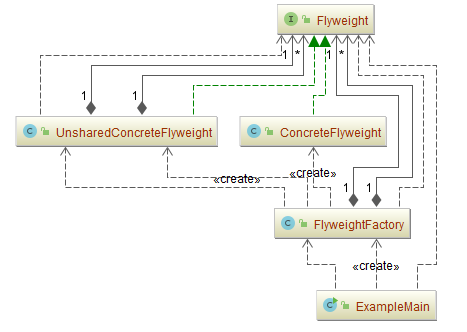

## 享元模式（Flyweight）

### 意图
运用共享技术有效地支持大量细粒度的对象。

### 动机

Flyweight模式描述了如何共享对象，使得可以细粒度地使用它们而无需高昂的代价。

flyweight是一个共享对象，它可以同时在多个场景(context)中使用，并且在每个场景中flyweight都可以作为一个独立的对象—这一点与非共享对象的实例没有区别。

flyweight不能对它所运行的场景做出任何假设，这里的关键概念是内部状态和外部状态之间的区别。

- 内部状态存储于flyweight中，它包含了独立于flyweight场景的信息，这些信息使得flyweight可以被共享。
- 外部状态取决于Flyweight场景，并根据场景而变化，因此不可共享。用户对象负责在必要的时候将外部状态传递给Flyweight。

### 适用性
Flyweight 模式的有效性很大程度上取决于如何使用它以及在何处使用它。

当以下情况都成立时使用 Flyweight 模式：

-	一个应用程序使用了大量的对象。
-	完全由于使用大量的对象，造成很大的存储开销。
-	对象的大多数状态都可变为外部状态。
-	如果删除对象的外部状态，那么可以用相对较少的共享对象取代很多组对象。
-	应用程序不依赖于对象标识。由于 Flyweight 对象可以被共享，对于概念上明显有别的对象，标识测试将返回真值。

### 参与者

-	**Flyweight**：抽象享元角色
	
	-	描述一个接口，通过这个接口flyweight可以接受并作用于外部状态。
-	**ConcreteFlyweight**：具体享元对象角色
	
- 实现Flyweight接口，并为内部状态（如果有的话）增加存储空间。
	
	  ConcreteFlyweight对象必须是可共享的。它所存储的状态必须是内部的。
	
	  即，它必须独立于ConcreteFlyweight对象的场景。
-	**UnsharedConcreteFlyweight**：复合享元角色
	
	- 并非所有的Flyweight子类都需要被共享。
	
	  Flyweight接口使共享成为可能，但它并不强制共享。
	
	  在Flyweight对象结构的某些层次，UnsharedConcreteFlyweight对象通常将ConcreteFlyweight对象作为子节点（Row和Column就是这样）。
-	**FlyweightFactory**：享元工厂角色
	
	-	创建并管理flyweight对象。
	-	确保合理地共享flyweight。当用户请求一个flyweight时，FlyweightFactory对象提供一个已创建的实例或者创建一个（如果不存在的话）。
-	**Client**：客户端
	
	-	维持一个对flyweight的引用。
	-	计算或存储一个（多个）flyweight的外部状态。
### 协作
- flyweight执行时所需的状态必定是内部的或外部的。

  内部状态存储于ConcreteFlyweight对象之中；而外部对象则由Client对象存储或计算。

  当用户调用flyweight对象的操作时，将该状态传递给它。

-	用户不应直接对ConcreteFlyweight类进行实例化，而只能从FlyweightFactory对象得到ConcreteFlyweight对象，这可以保证对它们适当地进行共享。

### 实现
在实现Flyweight模式时，注意以下几点：
- **删除外部状态**

  该模式的可用性在很大程度上取决于是否容易识别外部状态并将它从共享对象中删除。

  如果不同种类的外部状态和共享前对象的数目相同的话，删除外部状态不会降低存储消耗。

  理想的状况是，外部状态可以由一个单独的对象结构计算得到，且该结构的存储要求非常小。

- **管理共享对象**

  因为对象是共享的，用户不能直接对它进行实例化，因此FlyweightFactory可以帮助用户查找某个特定的Flyweight对象。

  共享还意味着某种形式的引用计数和垃圾回收，这样当一个Flyweight不再使用时，可以回收它的存储空间。

  然而，当Flyweight的数目固定而且很小的时候（例如，用于ACSII码的Flyweight），这两种操作都不必要。在这种情况下，Flyweight完全可以永久保存。

### 示例一：通用源代码 

- [Flyweight.java](Pattern46_Flyweight/src/main/java/com/jueee/example01/Flyweight.java)：抽象享元角色

- [ConcreteFlyweight.java](Pattern46_Flyweight/src/main/java/com/jueee/example01/ConcreteFlyweight.java)：具体享元对象角色

- [UnsharedConcreteFlyweight.java](Pattern46_Flyweight/src/main/java/com/jueee/example01/UnsharedConcreteFlyweight.java)：复合享元角色

- [FlyweightFactory.java](Pattern46_Flyweight/src/main/java/com/jueee/example01/FlyweightFactory.java)：享元工厂角色

- [ExampleMain.java](Pattern46_Flyweight/src/main/java/com/jueee/example01/ExampleMain.java)：客户端

