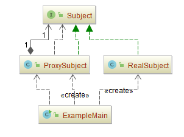
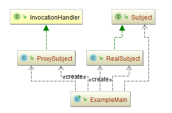
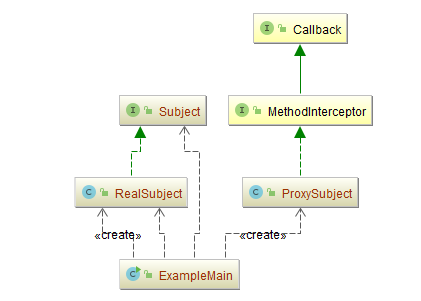

## 代理模式（Proxy）

### 意图
为其他对象提供一种代理以控制对这个对象的访问。

### 动机
对一个对象进行访问控制的一个原因是为了只有在我们确实需要这个对象时才对它进行创建和初始化。

我们考虑一个可以在文档中嵌入图形对象的文档编辑器。有些图形对象（如大型光栅图像）的创建开销很大。但是打开文档必须很迅速，因此我们在打开文档时应避免一次性创建所有开销很大的对象。因为并非所有这些对象在文档中都同时可见，所以也没有必要同时创建这些对象。

这一限制条件意味着，对于每一个开销很大的对象，应该根据需要进行创建，当一个图像变为可见时会产生这样的需要。

问题的解决方案是使用另一个对象，即图像Proxy，替代那个真正的图像。

Proxy可以代替一个图像对象，并且在需要时负责实例化这个图像对象。

### 适用性
在需要用比较通用和复杂的对象指针代替简单的指针的时候，使用Proxy模式。

下面是一些可以使用Proxy模式常见情况：

- **远程代理**（Remote Proxy）

  为一个对象在不同的地址空间提供局部代表。

- **虚代理**（Virtual Proxy）

  根据需要创建开销很大的对象。

- **保护代理**（Protection Proxy）

  控制对原始对象的访问。保护代理用于对象应该有不同的访问权限的时候。

-	**缓冲代理**（Cache Proxy）：

  为一个目标的操作结果开辟一个临时的空间存储，以便多个客户端共享使用。

-	**智能指引**（Smart Reference）

	取代了简单的指针，它在访问对象时执行一些附加操作。
	
	它的典型用途包括：
	
	-	对指向实际对象的引用计数，这样当该对象没有引用时，可以自动释放它。
	-	当第一次引用一个持久对象时，将它装入内存。
	-	在访问一个实际对象前，检查是否已经锁定了它，以确保其他对象不能改变它。

### 参与者
-	**Proxy**：代理主题角色
	-	保存一个引用使得代理可以访问实体。若RealSubject和Subject的接口相同，Proxy会引用Subject。
	-	提供一个与Subject的接口相同的接口，这样代理就可以用来替代实体。
	-	控制对实体的存取，并可能负责创建和删除它。
	-	其他功能依赖于代理的类型：
		-	**Remote Proxy**负责对请求及其参数进行编码，并向不同地址空间中的实体发送已编码的请求。
		-	**Virtual Proxy**可以缓存实体的附加信息，以便延迟对它的访问。
		-	**Protection Proxy**检查调用者是否具有实现一个请求所必需的访问权限。
-	**Subject**：抽象主题角色
	-	定义RealSubject和Proxy的共用接口，这样就在任何使用RealSubject的地方都可以使用Proxy。
-	**RealSubject**：真实主题角色
	-	定义Proxy所代表的实体。
### 协作
代理根据其种类，在适当的时候向`RealSubject`转发请求。

### 示例一：静态代理

代理类接受一个Subject接口的对象，任何实现该接口的对象，都可以通过代理类进行代理，增加了通用性。

但是也有缺点：

- 每一个代理类都必须实现一遍委托类（也就是realsubject）的接口，如果接口增加方法，则代理类也必须跟着
- 代理类每一个接口对象对应一个委托对象，如果委托对象非常多，则静态代理类就非常臃肿，难以胜任。

示例代码：

- [ProxySubject.java](Pattern47_Proxy/src/main/java/com/jueee/example01/ProxySubject.java)：代理主题角色
- [Subject.java](Pattern47_Proxy/src/main/java/com/jueee/example01/Subject.java)：抽象主题角色
- [RealSubject.java](Pattern47_Proxy/src/main/java/com/jueee/example01/RealSubject.java)：真实主题角色
- [ExampleMain.java](Pattern47_Proxy/src/main/java/com/jueee/example01/ExampleMain.java)：测试类



### 示例二：动态代理

动态代理有别于静态代理，是根据代理的对象，动态创建代理类。

这样，就可以避免静态代理中代理类接口过多的问题。

动态代理是实现方式，是通过反射来实现的，借助Java自带的`java.lang.reflect.Proxy`,通过固定的规则生成。

- [ProxySubject.java](Pattern47_Proxy/src/main/java/com/jueee/example02/ProxySubject.java)：代理主题角色，动态代理类，实现`InvocationHandler`接口，并重写该`invoke`方法。
- [Subject.java](Pattern47_Proxy/src/main/java/com/jueee/example02/Subject.java)：抽象主题角色
- [RealSubject.java](Pattern47_Proxy/src/main/java/com/jueee/example02/RealSubject.java)：真实主题角色
- [ExampleMain.java](Pattern47_Proxy/src/main/java/com/jueee/example02/ExampleMain.java)：测试类，生成动态代理的对象。



### 示例三：Cglib代理

需要引入Cglib的jar文件，在Maven中可以直接在POM.xml中添加下列引用即可：

```xml
<dependency>
	<groupId>cglib</groupId>
	<artifactId>cglib</artifactId>
	<version>3.2.5</version>
</dependency>
```

- [ProxySubject.java](Pattern47_Proxy/src/main/java/com/jueee/example03/ProxySubject.java)：代理主题角色，动态代理类，实现`net.sf.cglib.proxy.MethodInterceptor`接口，并重写该`invoke`方法。
- [Subject.java](Pattern47_Proxy/src/main/java/com/jueee/example03/Subject.java)：抽象主题角色
- [RealSubject.java](Pattern47_Proxy/src/main/java/com/jueee/example03/RealSubject.java)：真实主题角色
- [ExampleMain.java](Pattern47_Proxy/src/main/java/com/jueee/example03/ExampleMain.java)：测试类，生成动态代理的对象。



