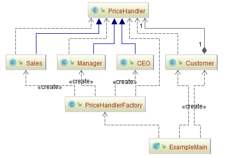

## 责任链模式（Chain of Responsibility）

### 意图
使多个对象都有机会处理请求，从而避免请求的发送者和接收者之间的耦合关系。

将这些对象连成一条链，并沿着这条链传递该请求，直到有一个对象处理它为止。

### 适用性
在以下条件下使用 Responsibility 链：
-	有多个的对象可以处理一个请求，哪个对象处理该请求运行时刻自动确定。
-	你想在不明确指定接收者的情况下，向多个对象中的一个提交一个请求。
-	可处理一个请求的对象集合应被动态指定。

### 参与者
-	**Handler**：抽象处理者
	-	定义一个处理请求的接口。
	-	（可选）实现后继链。
-	**ConcreteHandler**：具体处理者
	-	处理它所负责的请求。
	-	可访问它的后继者。
	-	如果可处理该请求，就处理之；否则将该请求转发给它的后继者。
-	**Client**：客户端
	-	向链上的具体处理者(ConcreteHandler)对象提交请求。
### 协作
当客户提交一个请求时，请求沿链传递直至有一个ConcreteHandler对象负责处理它。

### 效果

Responsibility链有下列优点和缺点(liabilities):

- **降低耦合度**

  该模式使得一个对象无需知道是其他哪一个对象处理其请求。对象仅需知道该请求会被“正确”地处理。

  接收者和发送者都没有对方的明确的信息，且链中的对象不需知道链的结构。

  结果是，职责链可简化对象的相互连接。它们仅需保持一个指向其后继者的引用，而不需保持它所有的候选接受者的引用。

- **增强了给对象指派职责(Responsibility)的灵活性**

  当在对象中分派职责时，职责链给你更多的灵活性。

  你可以通过在运行时刻对该链进行动态的增加或修改来增加或改变处理一个请求的那些职责。你可以将这种机制与静态的特例化处理对象的继承机制结合起来使用。

- **不保证被接受**

  既然一个请求没有明确的接收者，那么就不能保证它一定会被处理—该请求可能一直到链的末端都得不到处理。

  一个请求也可能因该链没有被正确配置而得不到处理。

### 示例一：请假条的审批过程

公司里面，请假条的审批过程：
-	如果请假天数小于3天，主任审批
-	如果请假天数大于等于3天，小于10天，经理审批
-	如果大于等于10天，小于30天，总经理审批
-	如果大于等于30天，提示拒绝

示例代码：

- **Data**：抽象数据封装
  
  - [LeaveRequest.java](Pattern501_ChainOfResponsibility/src/main/java/com/jueee/example01/LeaveRequest.java)：封装请假的相关信息
  
- **Handler**：抽象处理者
  
  - [Leader.java](Pattern501_ChainOfResponsibility/src/main/java/com/jueee/example01/Leader.java)：领导的抽象类
  
- **ConcreteHandler**：具体处理者

  - [Director.java](Pattern501_ChainOfResponsibility/src/main/java/com/jueee/example01/Director.java)：主任的实现类

  -	[Manager.java](Pattern501_ChainOfResponsibility/src/main/java/com/jueee/example01/Manager.java)：经理的实现类
  -	[ViceGeneralManager.java](Pattern501_ChainOfResponsibility/src/main/java/com/jueee/example01/ViceGeneralManager.java)：副总经理的实现类
  -	[GeneralManager.java](Pattern501_ChainOfResponsibility/src/main/java/com/jueee/example01/GeneralManager.java)：总经理的实现类

- **Client**：客户端

  - [ExampleMain.java](Pattern501_ChainOfResponsibility/src/main/java/com/jueee/example01/ExampleMain.java)：客户端调用测试

### 示例二：折扣审批流程

在购置房产的社会，购房者会想要一定的折扣，但是根据买的量级的不同，享受的折扣也是不一样的。

-	[PriceHandler.java](Pattern501_ChainOfResponsibility/src/main/java/com/jueee/example02/PriceHandler.java)：定义一个接口，之后的处理人都要实现这个接口
-	[Sales.java](Pattern501_ChainOfResponsibility/src/main/java/com/jueee/example02/Sales.java)：销售员，可以批准10%以内的折扣
-	[Manager.java](Pattern501_ChainOfResponsibility/src/main/java/com/jueee/example02/Manager.java)：经理，可以批准30%以内的折扣
-	[CEO.java](Pattern501_ChainOfResponsibility/src/main/java/com/jueee/example02/CEO.java)：CEO，可以批准50%以内的折扣
-	[Customer.java](Pattern501_ChainOfResponsibility/src/main/java/com/jueee/example02/Customer.java)：定义一个顾客类，里面发起申请
-	[PriceHandlerFactory.java](Pattern501_ChainOfResponsibility/src/main/java/com/jueee/example02/PriceHandlerFactory.java)：创建一个工厂，将各个的处理级别连成链
-	[ExampleMain.java](Pattern501_ChainOfResponsibility/src/main/java/com/jueee/example02/ExampleMain.java)：测试类

