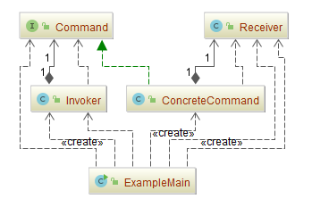
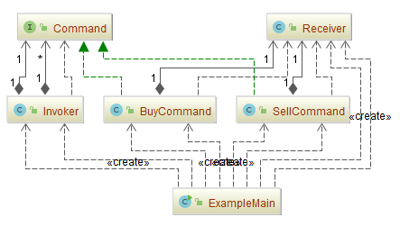

## 命令模式（Command）

### 意图
将一个请求封装为一个对象，从而使你可用不同的请求对客户进行参数化；对请求排队或记录请求日志，以及支持可撤消的操作。

### 动机

有时必须向某对象提交请求，但并不知道关于被请求的操作或请求的接受者的任何信息。

命令模式通过将请求本身变成一个对象来使工具箱对象可向未指定的应用对象提出请求。这个对象可被存储并像其他的对象一样被传递。

这一模式的关键是一个抽象的Command类，它定义了一个执行操作的接口。

其最简单的形式是一个抽象的Execute操作。

具体的Command子类将接收者作为其一个实例变量，并实现Execute操作，指定接收者采取的动作。而接收者有执行该请求所需的具体信息。

### 适用性
当你有如下需求时，可使用Command模式：
-	抽象出待执行的动作以参数化某对象。可以用过程语言中的回调（callback）函数表达这种参数化机制。所谓回调函数是指函数先在某处注册，而它将在稍后某个需要的时候被调用。Command模式是回调机制的一个面向对象的替代品。
-	在不同的时刻指定、排列和执行请求。一个Command对象可以有一个与初始请求无关的生存期。如果一个请求的接收者可用一种与地址空间无关的方式表达，那么就可将负责该请求的命令对象传送给另一个不同的进程并在那儿实现该请求。
-	支持取消操作。Command的Excute操作可在实施操作前将状态存储起来，在取消操作时这个状态用来消除该操作的影响。Command接口必须添加一个Unexecute操作，该操作取消上一次Execute调用的效果。执行的命令被存储在一个历史列表中。可通过向后和向前遍历这一列表并分别调用Unexecute和Execute来实现重数不限的“取消”和“重做”。
-	支持修改日志，这样当系统崩溃时，这些修改可以被重做一遍。在Command接口中添加装载操作和存储操作，可以用来保持变动的一个一致的修改日志。从崩溃中恢复的过程包括从磁盘中重新读入记录下来的命令并用Execute操作重新执行它们。
-	用构建在原语操作上的高层操作构造一个系统。这样一种结构在支持事务(transaction)的信息系统中很常见。一个事务封装了对数据的一组变动。Command模式提供了对事务进行建模的方法。Command有一个公共的接口，使得你可以用同一种方式调用所有的事务。同时使用该模式也易于添加新事务以扩展系统。

### 参与者
-	**Command**：抽象命令，包含命令执行的抽象方法
	-	声明执行操作的接口。
-	**ConcreteCommand**：它包含一个命令接收者对象，并调用接收者的对象相应实现方法。
	-	将一个接收者对象绑定于一个动作。
	-	调用接收者相应的操作，以实现Execute。
-	**Invoker**：提供给客户端调用，接收客户端所传递的具体命令对象。
	-	要求该命令执行这个请求。
-	**Receiver**：命令接收者角色，它包含所有命令的具体行为实现方法。
	-	知道如何实施与执行一个请求相关的操作。任何类都可能作为一个接收者。
-	**Client**：客户端
	-	创建一个具体命令对象并设定它的接收者。
### 协作
-	`Client`创建一个`ConcreteCommand`对象并指定它的Receiver对象。
-	某`Invoker`对象存储该`ConcreteCommand`对象。
-	该`Invoker`通过调用`Command`对象的`Execute`操作来提交一个请求。若该命令是可撤消的，
`ConcreteCommand`就在执行`Excute`操作之前存储当前状态以用于取消该命令。
-	`ConcreteCommand`对象对调用它的`Receiver`的一些操作以执行该请求。
### 效果
Command模式有以下效果:
-	Command模式将调用操作的对象与知道如何实现该操作的对象解耦。
-	Command是头等的对象。它们可像其他的对象一样被操纵和扩展。
-	你可将多个命令装配成一个复合命令。例如是前面描述的MacroCommand类。一般说来，复合命令是Composite模式的一个实例。
-	增加新的Command很容易，因为这无需改变已有的类。

### 优点
- 命令模式将行为调用者和各种行为分隔开，降低程序的耦合，便于程序扩展。
- 命令模式将行为的具体实现封装起来，客户端无需关心行为的具体实现。
- 命令模式可为多种行为提供统一的调用入口，便于程序对行为的管理和控制。

### 示例一：通用源代码

司令员下令让士兵去干件事情，从整个事情的角度来考虑，司令员的作用是，发出口令，口令经过传递，传到了士兵耳朵里，士兵去执行。

这个过程好在，三者(司令、命令、士兵)相互解耦，任何一方都不用去依赖其他人的具体实现，只需要做好自己的事儿就行，司令员要的是结果，不会去关注到底士兵是怎么实现的。

-	[Command.java](Pattern502_Command/src/main/java/com/jueee/example01/Command.java)：命令执行的接口
-	[ConcreteCommand.java](Pattern502_Command/src/main/java/com/jueee/example01/ConcreteCommand.java)：具体实现的命令
-	[Invoker.java](Pattern502_Command/src/main/java/com/jueee/example01/Invoker.java)：调用者（司令员）
-	[Receiver.java](Pattern502_Command/src/main/java/com/jueee/example01/Receiver.java)：被调用者（士兵）
-	[ExampleMain.java](Pattern502_Command/src/main/java/com/jueee/example01/ExampleMain.java)：测试类

### 示例二：多个请求命令

-	[Command.java](Pattern502_Command/src/main/java/com/jueee/example02/Command.java)：命令执行的接口
-	[BuyCommand.java](Pattern502_Command/src/main/java/com/jueee/example02/BuyCommand.java)、[SellCommand.java](Pattern502_Command/src/main/java/com/jueee/example02/SellCommand.java)：具体实现的命令
-	[Invoker.java](Pattern502_Command/src/main/java/com/jueee/example01/Invoker.java)：命令调用类
-	[Receiver.java](Pattern502_Command/src/main/java/com/jueee/example01/Receiver.java)：请求类
-	[ExampleMain.java](Pattern502_Command/src/main/java/com/jueee/example01/ExampleMain.java)：测试类

