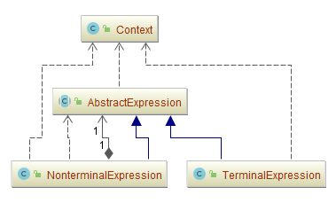
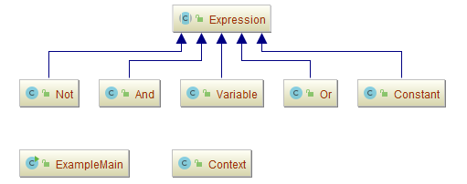
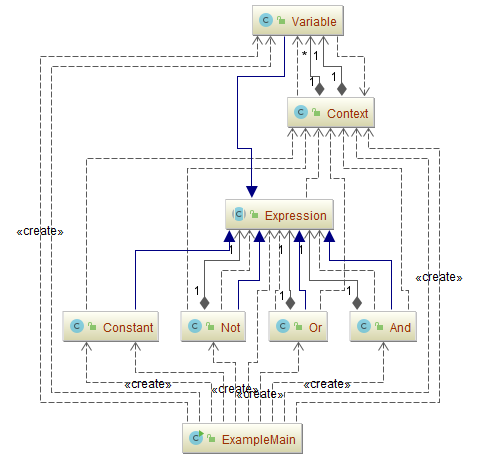
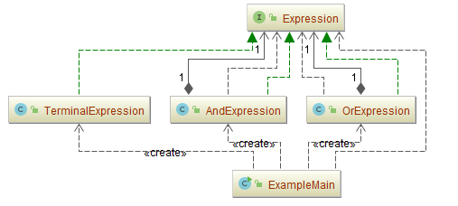
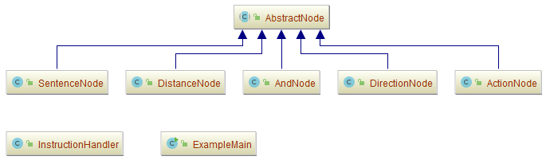
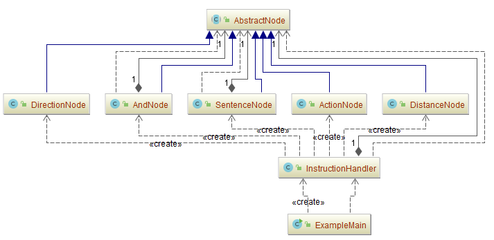

## 解释器模式（Interpreter）

### 意图
给定一个语言，定义它的文法的一种表示，并定义一个解释器，这个解释器使用该表示来解释语言中的句子。

### 动机
如果一种特定类型的问题发生的频率足够高 , 那么可能就值得将该问题的各个实例表述为一个简单语言中的句子。这样就可以构建一个解释器 , 该解释器通过解释这些句子来解决该问题。

解释器模式描述了如何为简单的语言定义一个文法 , 如何在该语言中表示一个句子 , 以及如何解释这些句子。

### 适用性
当有一个语言需要解释执行 , 并且你可将该语言中的句子表示为一个抽象语法树时，可使用解释器模式。

而当存在以下情况时该模式效果最好：

- **该文法简单**

  对于复杂的文法 , 文法的类层次变得庞大而无法管理。此时语法分析程序生成器这样的工具是更好的选择。它们无需构建抽象语法树即可解释表达式 , 这样可以节省空间而且还可能节省时间。

- **效率不是一个关键问题**

  最高效的解释器通常不是通过直接解释语法分析树实现的 , 而是首先将它们转换成另一种形式。例如，正则表达式通常被转换成状态机。但即使在这种情况下, 转换器仍可用解释器模式实现, 该模式仍是有用的。

### 参与者
-	**AbstractExpression**（抽象表达式）
	-	声明一个抽象的解释操作，这个接口为抽象语法树中所有的节点所共享。
-	**TerminalExpression**（终结符表达式）
	-	实现与文法中的终结符相关联的解释操作。
	-	一个句子中的每个终结符需要该类的一个实例。
-	**NonterminalExpression**（非终结符表达式）
	-	对文法中的每一条规则R::=R1R2...Rn都需要一个`NonterminalExpression`类。
	-	为从R1到Rn的每个符号都维护一个`AbstractExpression`类型的实例变量。
	-	为文法中的非终结符实现解释(`Interpret`)操作。解释(`Interpret`)一般要递归地调用表示R1到Rn的那些对象的解释操作。
-	**Context**（上下文）
	-	包含解释器之外的一些全局信息。
-	**Client**（客户）
	-	构建(或被给定)表示该文法定义的语言中一个特定的句子的抽象语法树。该抽象语法树由`NonterminalExpression`和`TerminalExpression`的实例装配而成。
	-	调用解释操作。
### 协作
-	`Client`构建(或被给定)一个句子,它是`NonterminalExpression`和`TerminalExpression`的实例的一个抽象语法树，然后初始化上下文并调用解释操作。
-	每一非终结符表达式节点定义相应子表达式的解释操作。而各终结符表达式的解释操作构成了递归的基础。
-	每一节点的解释操作用上下文来存储和访问解释器的状态。

### 效果
解释器模式有下列的优点和不足:
- **易于改变和扩展文法**

  因为该模式使用类来表示文法规则 , 你可使用继承来改变或扩展该文法。已有的表达式可被增量式地改变 ，而新的表达式可定义为旧表达式的变体。

- **易于实现文法**

  定义抽象语法树中各个节点的类的实现大体类似。这些类易于直接编写，通常它们也可用一个编译器或语法分析程序生成器自动生成。

- **复杂的文法难以维护**

  解释器模式为文法中的每一条规则至少定义了一个类(使用BNF定义的文法规则需要更多的类)。因此包含许多规则的文法可能难以管理和维护。可应用其他的设计模式来缓解这一问题。但当文法非常复杂时, 其他的技术如语法分析程序或编译器生成器更为合适。

- **增加了新的解释表达式的方式**

  解释器模式使得实现新表达式“计算”变得容易。 例如,你可以在表达式类上定义一个新的操作以支持优美打印或表达式的类型检查。如果你经常创建新的解释表达式的方式, 那么可以考虑使用Visitor模式以避免修改这些代表文法的类。

### 示例一：通用源代码

-	[AbstractExpression.java](Pattern503_Interpreter/src/main/java/com/jueee/example01/AbstractExpression.java)（抽象表达式）
-	[TerminalExpression.java](Pattern503_Interpreter/src/main/java/com/jueee/example01/TerminalExpression.java)（终结符表达式）
-	[NonterminalExpression.java](Pattern503_Interpreter/src/main/java/com/jueee/example01/NonterminalExpression.java)（非终结符表达式）
-	[Context.java](Pattern503_Interpreter/src/main/java/com/jueee/example01/Context.java)（上下文）
-	Client（客户）

### 示例二：模拟Java语言中对布尔表达式进行操作和求值

-	[Expression.java](Pattern503_Interpreter/src/main/java/com/jueee/example02/Expression.java)（抽象表达式）
-	[Variable.java](Pattern503_Interpreter/src/main/java/com/jueee/example02/Variable.java)
  （终结符表达式）：代表一个有名变量
-	NonterminalExpression：（非终结符表达式）
  -	[And.java](Pattern503_Interpreter/src/main/java/com/jueee/example02/And.java)：代表逻辑“与”操作
  -	[Constant.java](Pattern503_Interpreter/src/main/java/com/jueee/example02/Constant.java)：代表一个布尔常量
  -	[Not.java](Pattern503_Interpreter/src/main/java/com/jueee/example02/Not.java)：代表逻辑“非”操作
  -	[Or.java](Pattern503_Interpreter/src/main/java/com/jueee/example02/Or.java) ：代表逻辑“或”操作
-	[Context.java](Pattern503_Interpreter/src/main/java/com/jueee/example02/Context.java)（上下文）：定义出从变量到布尔值的一个映射
-	[ExampleMain.java](Pattern503_Interpreter/src/main/java/com/jueee/example02/ExampleMain.java)（客户）

### 示例三：与或逻辑判断

-	[Expression.java](Pattern503_Interpreter/src/main/java/com/jueee/example03/Expression.java)（抽象表达式）
-	[TerminalExpression.java](Pattern503_Interpreter/src/main/java/com/jueee/example03/TerminalExpression.java)（终结符表达式）：代表一个有名变量
-	NonterminalExpression：（非终结符表达式）
  -	[AndExpression.java](Pattern503_Interpreter/src/main/java/com/jueee/example03/AndExpression.java)：代表逻辑“与”操作
  -	[OrExpression.java](Pattern503_Interpreter/src/main/java/com/jueee/example03/OrExpression.java)：代表逻辑“或”操作
-	String（上下文）：定义出从变量到布尔值的一个映射
-	[ExampleMain.java](Pattern503_Interpreter/src/main/java/com/jueee/example03/ExampleMain.java)（客户）

### 示例四：动作解释翻译器

-	[AbstractNode.java](Pattern503_Interpreter/src/main/java/com/jueee/example04/AbstractNode.java)（抽象表达式）
-	[SentenceNode.java](Pattern503_Interpreter/src/main/java/com/jueee/example04/SentenceNode.java)
  （终结符表达式）：代表一个有名变量
-	NonterminalExpression：（非终结符表达式）
  -	[AndNode.java](Pattern503_Interpreter/src/main/java/com/jueee/example04/AndNode.java)：链接动作
  -	[ActionNode.java](Pattern503_Interpreter/src/main/java/com/jueee/example04/ActionNode.java)：动作
  -	[DirectionNode.java](Pattern503_Interpreter/src/main/java/com/jueee/example04/DirectionNode.java)：方向
  -	[DistanceNode.java](Pattern503_Interpreter/src/main/java/com/jueee/example04/DistanceNode.java) ：距离
-	String：定义出从变量到布尔值的一个映射
-	[InstructionHandler.java](Pattern503_Interpreter/src/main/java/com/jueee/example04/InstructionHandler.java)：语法树解释器
-	[ExampleMain.java](Pattern503_Interpreter/src/main/java/com/jueee/example04/ExampleMain.java)（客户）

