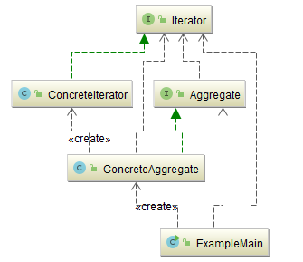
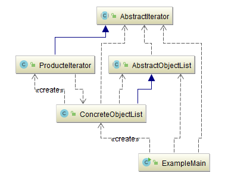

## 迭代器模式（Iterator）

### 意图
提供一种方法顺序访问一个聚合对象中各个元素 , 而又不需暴露该对象的内部表示。

### 动机

迭代器模式的关键思想是将对列表的访问和遍历从列表对象中分离出来并放入一个迭代器（iterator）对象中。迭代器类定义了一个访问该列表元素的接口。迭代器对象负责跟踪当前的元素，即，它知道哪些元素已经遍历过了。

### 适用性
迭代器模式可用来：
-	访问一个聚合对象的内容而无需暴露它的内部表示。
-	支持对聚合对象的多种遍历。
-	为遍历不同的聚合结构提供一个统一的接口(即,支持多态迭代)。
### 优缺点 
#### 优点 
-	它支持以不同的方式遍历一个聚合对象，在同一个聚合对象上可以定义多种遍历方式。在迭代器模式中只需要用一个不同的迭代器来替换原有迭代器即可改变遍历算法，我们也可以自己定义迭代器的子类以支持新的遍历方式。 
-	迭代器简化了聚合类。由于引入了迭代器，在原有的聚合对象中不需要再自行提供数据遍历等方法，这样可以简化聚合类的设计。 
-	在迭代器模式中，由于引入了抽象层，增加新的聚合类和迭代器类都很方便，无须修改原有代码，满足“开闭原则”的要求。 
#### 缺点 
-	由于迭代器模式将存储数据和遍历数据的职责分离，增加新的聚合类需要对应增加新的迭代器类，类的个数成对增加，这在一定程度上增加了系统的复杂性。 
-	抽象迭代器的设计难度较大，需要充分考虑到系统将来的扩展，例如 JDK 内置迭代器 Iterator 就无法实现逆向遍历，如果需要实现逆向遍历，只能通过其子类 ListIterator 等来实现，而 ListIterator 迭代器无法用于操作 Set 类型的聚合对象。在自定义迭代器时，创建一个考虑全面的抽象迭代器并不是件很容易的事情。 

### 参与者
-	**Iterator**：（迭代器）
	-	迭代器定义访问和遍历元素的接口。
-	**ConcreteIterator**：（具体迭代器）
	-	具体迭代器实现迭代器接口。
	-	对该聚合遍历时跟踪当前位置。
-	**Aggregate**：（聚合）
	-	聚合定义创建相应迭代器对象的接口。
-	**ConcreteAggregate**：（具体聚合）
	-	具体聚合实现创建相应迭代器的接口，该操作返回ConcreteIterator的一个适当的实例。

### 协作
-	**ConcreteIterator **跟踪聚合中的当前对象，并能够计算出待遍历的后继对象。
### 效果
迭代器模式有三个重要的作用：
- **它支持以不同的方式遍历一个聚合**

  复杂的聚合可用多种方式进行遍历。

  例如 , 代码生成和语义检查要遍历语法分析树。代码生成可以按中序或者按前序来遍历语法分析树。

  迭代器模式使得改变遍历算法变得很容易: 仅需用一个不同的迭代器的实例代替原先的实例即可。

- **迭代器简化了聚合的接口**

  有了迭代器的遍历接口，聚合本身就不再需要类似的遍历接口了。这样就简化了聚合的接口。

- **在同一个聚合上可以有多个遍历**

  每个迭代器保持它自己的遍历状态。因此你可以同时进行多个遍历。

### 示例一：通用源代码

- [Iterator.java](Pattern504_Iterator/src/main/java/com/jueee/example01/Iterator.java)：（迭代器）迭代器定义访问和遍历元素的接口。
- [ConcreteIterator.java](Pattern504_Iterator/src/main/java/com/jueee/example01/ConcreteIterator.java)：（具体迭代器）具体迭代器实现迭代器接口，并对该聚合遍历时跟踪当前位置。
- [Aggregate.java](Pattern504_Iterator/src/main/java/com/jueee/example01/Aggregate.java)：（聚合）聚合定义创建相应迭代器对象的接口。
- [ConcreteAggregate.java](Pattern504_Iterator/src/main/java/com/jueee/example01/ConcreteAggregate.java)：（具体聚合）具体聚合实现创建相应迭代器的接口。
- [ExampleMain.java](Pattern504_Iterator/src/main/java/com/jueee/example01/ExampleMain.java)：测试类

### 示例二：通用源代码

- [AbstractIterator.java](Pattern504_Iterator/src/main/java/com/jueee/example02/AbstractIterator.java)：（迭代器）迭代器定义访问和遍历元素的接口。
- [ProducteIterator.java](Pattern504_Iterator/src/main/java/com/jueee/example02/ProducteIterator.java)：（具体迭代器）具体迭代器实现迭代器接口，并对该聚合遍历时跟踪当前位置。
- [AbstractObjectList.java](Pattern504_Iterator/src/main/java/com/jueee/example02/AbstractObjectList.java)：（聚合）聚合定义创建相应迭代器对象的接口。
- [ConcreteObjectList.java](Pattern504_Iterator/src/main/java/com/jueee/example02/ConcreteObjectList.java)：（具体聚合）具体聚合实现创建相应迭代器的接口。
- [ExampleMain.java](Pattern504_Iterator/src/main/java/com/jueee/example02/ExampleMain.java)：测试类

