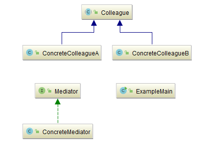
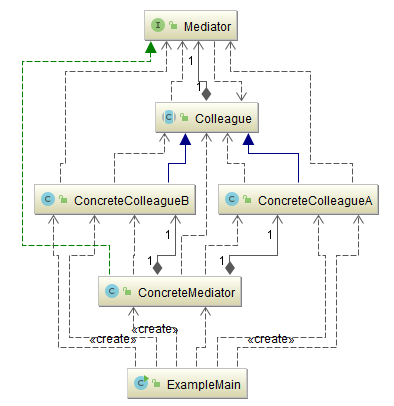
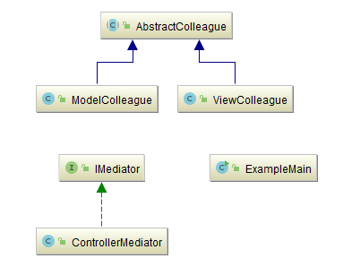
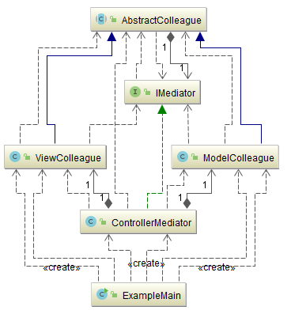

## 中介者模式（Mediator）

### 意图
用一个中介对象来封装一系列的对象交互。

中介者使各对象不需要显式地相互引用，从而使其耦合松散，而且可以独立地改变它们之间的交互。

### 适用性
在下列情况下使用中介者模式:
-	一组对象以定义良好但是复杂的方式进行通信。产生的相互依赖关系结构混乱且难以理解。
-	一个对象引用其他很多对象并且直接与这些对象通信,导致难以复用该对象。
-	想定制一个分布在多个类中的行为，而又不想生成太多的子类。
### 参与者
-	**Mediator**(抽象中介者)
	-	中介者定义一个接口用于与各同事（Colleague）对象通信。
-	**ConcreteMediator**(具体中介者)
	-	具体中介者通过协调各同事对象实现协作行为。
	-	了解并维护它的各个同事。
-	**Colleague**(抽象同事类)
  - 定义出调停者到同事对象的接口。同事对象只知道中介者对象而不知道其余的同事对象。
-	**ConcreteColleague**(具体同事类)
	-	每一个同事类都知道它的中介者对象。
	-	每一个同事对象在需与其他的同事通信的时候，与它的中介者通信。
### 协作
-	同事向一个中介者对象发送和接收请求。中介者在各同事间适当地转发请求以实现协作行为。
### 效果
中介者模式有以下优点和缺点:
- **减少了子类生成**

  Mediator将原本分布于多个对象间的行为集中在一起。改变这些行为只需生成Meditator的子类即可。这样各个Colleague类可被重用。

- **它将各Colleague解耦**

  Mediator有利于各Colleague间的松耦合.你可以独立的改变和复用各Colleague类和Mediator类。

- **它简化了对象协议**

  用Mediator和各Colleague间的一对多的交互来代替多对多的交互。一对多的关系更易于理解、维护和扩展。

- **它对对象如何协作进行了抽象将**

  中介作为一个独立的概念并将其封装在一个对象中，使你将注意力从对象各自本身的行为转移到它们之间的交互上来。这有助于弄清楚一个系统中的对象是如何交互的。

- **它使控制集中化**

  中介者模式将交互的复杂性变为中介者的复杂性。因为中介者封装了协议,它可能变得比任一个Colleague都复杂。这可能使得中介者自身成为一个难于维护的庞然大物。

### 示例一：通用源代码

- [Mediator.java](Pattern505_Mediator/src/main/java/com/jueee/example01/Mediator.java) (抽象中介者)
- [ConcreteMediator.java](Pattern505_Mediator/src/main/java/com/jueee/example01/ConcreteMediator.java) (具体中介者)
- [Colleague.java](Pattern505_Mediator/src/main/java/com/jueee/example01/Colleague.java) (抽象同事类)
- [ConcreteColleagueA.java](Pattern505_Mediator/src/main/java/com/jueee/example01/ConcreteColleagueA.java)、[ConcreteColleagueB.java](Pattern505_Mediator/src/main/java/com/jueee/example01/ConcreteColleagueB.java) (具体同事类)
- [ExampleMain.java](Pattern505_Mediator/src/main/java/com/jueee/example01/ExampleMain.java) (测试类)





### 示例二：用中介者模式表现MVC架构

在中介者中保存了两个Colleague对象，如果说我们现在展示的不是MVC，而是MVVM框架，那么就会有更多的实例保存在终结者中。这个是无法避免的，中介者必须拥有所有的协同者。

- [IMediator.java](Pattern505_Mediator/src/main/java/com/jueee/example02/IMediator.java)(抽象中介者)：定义了一个用于反馈的方法
- [ControllerMediator.java](Pattern505_Mediator/src/main/java/com/jueee/example02/ControllerMediator.java)(具体中介者)
- [AbstractColleague.java](Pattern505_Mediator/src/main/java/com/jueee/example02/AbstractColleague.java)(抽象同事类)：包含一个中介者的实例。
- [ModelColleague.java](Pattern505_Mediator/src/main/java/com/jueee/example02/ModelColleague.java)、[ViewColleague.java](Pattern505_Mediator/src/main/java/com/jueee/example02/ViewColleague.java)(具体同事类)：定义两个具体的协同者
- [ExampleMain.java](Pattern505_Mediator/src/main/java/com/jueee/example02/ExampleMain.java)(测试类)：先将协同者和中介者进行关联，然后尝试模拟View的变更以及Model的变更。





View出现了状态的改变，但它不需要知道有谁需要因此而做什么事情，只需要告诉中介者即可，Model亦然。两者存在着数据和信息的交换，但是又不知道彼此，一个中介者将两者完美地解耦了。输出：

```
----
View got a click action.
Model should return some data to view.
View got data from model.
----
Model will shutdown in 5 sec.
View knows that: Model gonna shutdown, backup your data.
```

