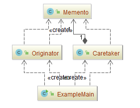
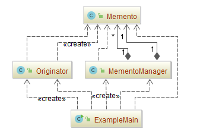

## 备忘录模式（Memento）

### 意图
在不破坏封装性的前提下，捕获一个对象的内部状态，并在该对象之外保存这个状态。这样以后就可将该对象恢复到原先保存的状态。

### 适用性
在以下情况下使用备忘录模式：
-	必须保存一个对象在某一个时刻的(部分)状态,这样以后需要时它才能恢复到先前的状态。
-	如果一个用接口来让其它对象直接得到这些状态，将会暴露对象的实现细节并破坏对象的封装性。
### 参与者
-	**Memento**：（备忘录）
	
	- 备忘录存储原发器对象的内部状态。原发器根据需要决定备忘录存储原发器的哪些内部状态。
	
	- 防止原发器以外的其他对象访问备忘录。
	
	  备忘录实际上有两个接口，管理者(caretaker)只能看到备忘录的窄接口——它只能将备忘录传递给其他对象。相反，原发器能够看到一个宽接口，允许它访问返回到先前状态所需的所有数据。理想的情况是只允许生成本备忘录的那个原发器访问本备忘录的内部状态。
	
-	**Originator**：（原发器）
	
	-	原发器创建一个备忘录,用以记录当前时刻它的内部状态。
	-	使用备忘录恢复内部状态.。
	
-	**Caretaker**：（备忘录管理员角色）
	
	-	负责保存好备忘录。
	-	不能对备忘录的内容进行操作或检查。
### 协作
-	管理器向原发器请求一个备忘录 , 保留一段时间后,将其送回给原发器 , 如下面的交互图所示。

### 效果
备忘录模式有以下一些效果:
- **保持封装边界**

  使用备忘录可以避免暴露一些只应由原发器管理却又必须存储在原发器之外的信息。该模式把可能很复杂的Originator内部信息对其他对象屏蔽起来，从而保持了封装边界。

- **它简化了原发器**

  在其他的保持封装性的设计中，Originator负责保持客户请求过的内部状态版本。这就把所有存储管理的重任交给了Originator。让客户管理它们请求的状态将会简化Originator，并且使得客户工作结束时无需通知原发器。

- **使用备忘录可能代价很高**

  如果原发器在生成备忘录时必须拷贝并存储大量的信息，或者客户非常频繁地创建备忘录和恢复原发器状态，可能会导致非常大的开销。除非封装和恢复Originator状态的开销不大，否则该模式可能并不合适。参见实现一节中关于增量式改变的讨论。

- **定义窄接口和宽接口**

  在一些语言中可能难以保证只有原发器可访问备忘录的状态。

- **维护备忘录的潜在代价**

  管理器负责删除它所维护的备忘录。然而，管理器不知道备忘录中有多少个状态。因此当存储备忘录时，一个本来很小的管理器，可能会产生大量的存储开销。

### 示例一：通用源代码

- [Memento.java](Pattern506_Memento/src/main/java/com/jueee/example01/Memento.java)：（备忘录）
- [Originator.java](Pattern506_Memento/src/main/java/com/jueee/example01/Originator.java)：（原发器）
- [Caretaker.java](Pattern506_Memento/src/main/java/com/jueee/example01/Caretaker.java)：（备忘录管理员角色）
- [ExampleMain.java](Pattern506_Memento/src/main/java/com/jueee/example01/ExampleMain.java)：（测试）

### 示例二：复杂备忘录角色

- [Memento.java](Pattern506_Memento/src/main/java/com/jueee/example02/Memento.java)：（备忘录）
- [Originator.java](Pattern506_Memento/src/main/java/com/jueee/example02/Originator.java)：（原发器）
- [MementoManager.java](Pattern506_Memento/src/main/java/com/jueee/example02/MementoManager.java)：（备忘录管理员角色）
- [ExampleMain.java](Pattern506_Memento/src/main/java/com/jueee/example02/ExampleMain.java)：（测试）

