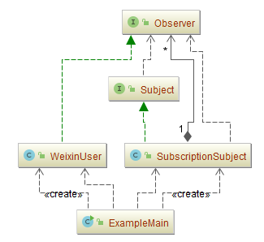
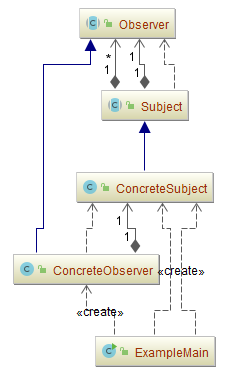
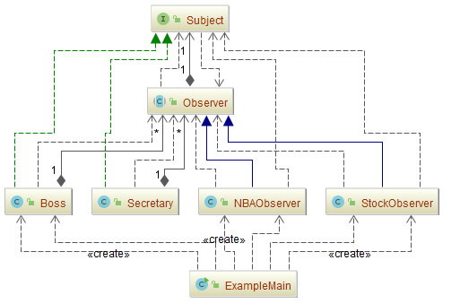
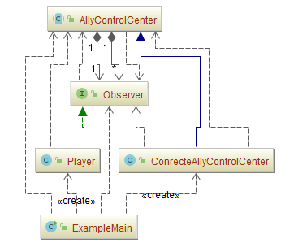

## 观察者模式（Observer）

### 意图
定义对象间的一种一对多的依赖关系 ,当一个对象的状态发生改变时, 所有依赖于它的对象都得到通知并被自动更新。

### 适用性
在以下任一情况下可以使用观察者模式:
-	当一个抽象模型有两个方面,其中一个方面依赖于另一方面。将这二者封装在独立的对象中以使它们可以各自独立地改变和复用。
-	当对一个对象的改变需要同时改变其它对象,而不知道具体有多少对象有待改变。
-	当一个对象必须通知其它对象，而它又不能假定其它对象是谁。换言之,你不希望这些对象是紧密耦合的。
### 参与者
-	**Subject**（抽象目标）
	-	目标知道它的观察者。可以有任意多个观察者观察同一个目标。
	-	提供注册和删除观察者对象的接口。
-	**Observer**（抽象观察者）
	-	为那些在目标发生改变时需获得通知的对象定义一个更新接口。
-	**ConcreteSubject**（具体目标）
	-	将有关状态存入各ConcreteObserver对象。
	-	当它的状态发生改变时,向它的各个观察者发出通知。
-	**ConcreteObserver**（具体观察者）
	-	维护一个指向ConcreteSubject对象的引用。
	-	存储有关状态，这些状态应与目标的状态保持一致。
	-	实现Observer的更新接口以使自身状态与目标的状态保持一致。
### 协作
-	当ConcreteSubject发生任何可能导致其观察者与其本身状态不一致的改变时，它将通知它的各个观察者。
-	在得到一个具体目标的改变通知后,ConcreteObserver对象可向目标对象查询信息。ConcreteObserver使用这些信息以使它的状态与目标对象的状态一致。

### 示例一：订阅微信公众号

以微信公众号为例，假设微信用户就是观察者，微信公众号是被观察者，有多个微信用户关注了“程序员”这个公众号，当这个公众号更新时就会通知这些订阅的微信用户。

- [Subject.java](Pattern507_Observer/src/main/java/com/jueee/example01/Subject.java)（抽象目标）
- [Observer.java](Pattern507_Observer/src/main/java/com/jueee/example01/Observer.java)（抽象观察者）
- [SubscriptionSubject.java](Pattern507_Observer/src/main/java/com/jueee/example01/SubscriptionSubject.java)（具体目标）：微信公众号
- [WeixinUser.java](Pattern507_Observer/src/main/java/com/jueee/example01/WeixinUser.java)（具体观察者）：微信用户
- [ExampleMain.java](Pattern507_Observer/src/main/java/com/jueee/example01/ExampleMain.java)（测试类）

### 示例二：通用源代码

- [Subject.java](Pattern507_Observer/src/main/java/com/jueee/example02/Subject.java)（抽象目标）
- [Observer.java](Pattern507_Observer/src/main/java/com/jueee/example02/Observer.java)（抽象观察者）
- [ConcreteSubject.java](Pattern507_Observer/src/main/java/com/jueee/example02/ConcreteSubject.java)（具体目标）
- [ConcreteObserver.java](Pattern507_Observer/src/main/java/com/jueee/example02/ConcreteObserver.java)（具体观察者）
- [ExampleMain.java](Pattern507_Observer/src/main/java/com/jueee/example02/ExampleMain.java)（测试类）

### 示例三：老板回来了

- [Subject.java](Pattern507_Observer/src/main/java/com/jueee/example03/Subject.java)（抽象目标）
- [Observer.java](Pattern507_Observer/src/main/java/com/jueee/example03/Observer.java)（抽象观察者）
- [Secretary.java](Pattern507_Observer/src/main/java/com/jueee/example03/Secretary.java)、[Boss.java](Pattern507_Observer/src/main/java/com/jueee/example03/Boss.java)（具体目标）
- [NBAObserver.java](Pattern507_Observer/src/main/java/com/jueee/example03/NBAObserver.java)、[StockObserver.java](Pattern507_Observer/src/main/java/com/jueee/example03/StockObserver.java)（具体观察者）
- [ExampleMain.java](Pattern507_Observer/src/main/java/com/jueee/example03/ExampleMain.java)（测试类）

### 示例四：组队战斗，遭受敌人攻击时通知队友

- [AllyControlCenter.java](Pattern507_Observer/src/main/java/com/jueee/example04/AllyControlCenter.java)（抽象目标）：指挥部类，当抽象目标类
- [Observer.java](Pattern507_Observer/src/main/java/com/jueee/example04/Observer.java)（抽象观察者）：有更新的方法，就是提出自己被打了。
- [ConrecteAllyControlCenter.java](Pattern507_Observer/src/main/java/com/jueee/example04/ConrecteAllyControlCenter.java)（具体目标）：将执行所有的操作，并给通知。
- [Player.java](Pattern507_Observer/src/main/java/com/jueee/example04/Player.java)（具体观察者）：加入战队，同时可以提出自己被打了然后请求支援。
- [ExampleMain.java](Pattern507_Observer/src/main/java/com/jueee/example04/ExampleMain.java)（测试类）

