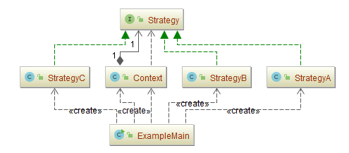
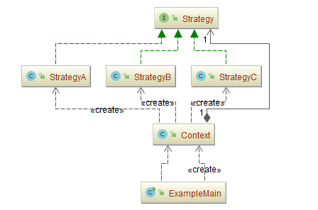
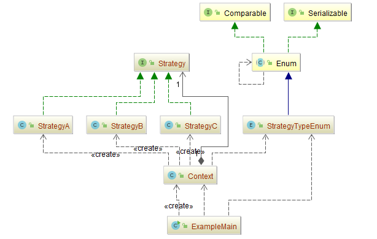

## 策略模式（Strategy）

### 意图
定义一系列的算法，把它们一个个封装起来，并且使它们可相互替换。本模式使得算法可独立于使用它的客户而变化。

### 适用性
当存在以下情况时使用Strategy模式
-	许多相关的类仅仅是行为有异。“策略”提供了一种用多个行为中的一个行为来配置一个类的方法。
-	需要使用一个算法的不同变体。例如，你可能会定义一些反映不同的空间/时间权衡的算法。当这些变体实现为一个算法的类层次时，可以使用策略模式。
-	算法使用客户不应该知道的数据。可使用策略模式以避免暴露复杂的、与算法相关的数据结构。
-	一个类定义了多种行为，并且这些行为在这个类的操作中以多个条件语句的形式出现。将相关的条件分支移入它们各自的Strategy类中以代替这些条件语句。

### 参与者
-	**Strategy**：（抽象策略角色）
	-	定义所有支持的算法的公共接口。Context使用这个接口来调用某ConcreteStrategy定义的算法。
-	**ConcreteStrategy**：（具体策略角色）
	-	以Strategy接口实现某具体算法。
-	**Context**：（上下文角色）
	-	用一个 ConcreteStrategy 对象来配置。
	-	维护一个对Strategy对象的引用。
	-	可定义一个接口来让Stategy访问它的数据。

### 协作
-	Strategy 和 Context 相互作用以实现选定的算法。当算法被调用时， Context 可以将该算法所需要的所有数据都传递给该 Stategy。或者，Context 可以将自身作为一个参数传递给 Strategy 操作。这就让 Strategy 在需要时可以回调 Context。
-	Context 将它的客户的请求转发给它的 Strategy。客户通常创建并传递一个 ConcreteStrategy 对象给该Context；这样，客户仅与 Context 交互。通常有一系列的 ConcreteStrategy 类可供客户从中选择。

### 效果
Strategy模式有下面的一些优点和缺点:
- **相关算法系列**

  Strategy类层次为Context定义了一系列的可供重用的算法或行为。继承有助于析取出这些算法中的公共功能。

- **一个替代继承的方法**

  继承提供了另一种支持多种算法或行为的方法。你可以直接生成一个Context类的子类，从而给它以不同的行为。但这会将行为硬行编制到Context中，而将算法的实现与Context的实现混合起来，从而使Context难以理解、难以维护和难以扩展，而且还不能动态地改变算法。最后你得到一堆相关的类，它们之间的唯一差别是它们所使用的算法或行为。将算法封装在独立的Strategy类中使得你可以独立于其Context改变它，使它易于切换、易于理解、易于扩展。

- **消除了一些条件语句**

  Strategy模式提供了用条件语句选择所需的行为以外的另一种选择。当不同的行为堆砌在一个类中时，很难避免使用条件语句来选择合适的行为。将行为封装在一个个独立的Strategy类中消除了这些条件语句。

- **实现的选择**

  Strategy 模式可以提供相同行为的不同实现。客户可以根据不同时间/空间权衡取舍要求从不同策略中进行选择。

- **客户必须了解不同的 Strategy**

  本模式有一个潜在的缺点，就是一个客户要选择一个合适的Strategy就必须知道这些Strategy到底有何不同。此时可能不得不向客户暴露具体的实现问题。因此仅当这些不同行为变体与客户相关的行为时，才需要使用Strategy模式。

- **Strategy 和 Context 之间的通信开销**

  无论各个ConcreteStrategy实现的算法是简单还是复杂，它们都共享Strategy定义的接口。因此很可能某些ConcreteStrategy不会都用到所有通过这个接口传递给它们的信息；简单的ConcreteStrategy可能不使用其中的任何信息！这就意味着有时Context会创建和初始化一些永远不会用到的参数。如果存在这样问题，那么将需要在Strategy和Context之间更进行紧密的耦合。

- **增加了对象的数目**

  Strategy 增加了一个应用中的对象的数目。有时你可以将Strategy实现为可供各Context共享的无状态的对象来减少这一开销。任何其余的状态都由Context维护。Context在每一次对Strategy对象的请求中都将这个状态传递过去。共享的Stragey不应在各次调用之间维护状态。

### 示例一：通用源代码

-	[Strategy.java](Pattern509_Strategy/src/main/java/com/jueee/example01/Strategy.java)：（抽象策略角色）
-	[StrategyA.java](Pattern509_Strategy/src/main/java/com/jueee/example01/StrategyA.java)、[StrategyB.java](Pattern509_Strategy/src/main/java/com/jueee/example01/StrategyB.java)、[StrategyC.java](Pattern509_Strategy/src/main/java/com/jueee/example01/StrategyC.java)：（具体策略角色）
-	[Context.java](Pattern509_Strategy/src/main/java/com/jueee/example01/Context.java)：（上下文角色）
-	[ExampleMain.java](Pattern509_Strategy/src/main/java/com/jueee/example01/ExampleMain.java)：（测试类）

### 示例二：简单工厂模式和策略模式结合

客户端只需要直接创建一个上下文，而不需要知道具体去创建的哪个对象。

-	[Strategy.java](Pattern509_Strategy/src/main/java/com/jueee/example02/Strategy.java)：（抽象策略角色）
-	[StrategyA.java](Pattern509_Strategy/src/main/java/com/jueee/example02/StrategyA.java)、[StrategyB.java](Pattern509_Strategy/src/main/java/com/jueee/example02/StrategyB.java)、[StrategyC.java](Pattern509_Strategy/src/main/java/com/jueee/example02/StrategyC.java)：（具体策略角色）
-	[Context.java](Pattern509_Strategy/src/main/java/com/jueee/example02/Context.java)：（上下文角色）
-	[ExampleMain.java](Pattern509_Strategy/src/main/java/com/jueee/example02/ExampleMain.java)：（测试类）

### 示例三：简单工厂模式+策略模式+枚举类

-	[Strategy.java](Pattern509_Strategy/src/main/java/com/jueee/example03/Strategy.java)：（抽象策略角色）
-	[StrategyA.java](Pattern509_Strategy/src/main/java/com/jueee/example03/StrategyA.java)、[StrategyB.java](Pattern509_Strategy/src/main/java/com/jueee/example03/StrategyB.java)、[StrategyC.java](Pattern509_Strategy/src/main/java/com/jueee/example03/StrategyC.java)：（具体策略角色）
-	[Context.java](Pattern509_Strategy/src/main/java/com/jueee/example03/Context.java)：（上下文角色）
-	[ExampleMain.java](Pattern509_Strategy/src/main/java/com/jueee/example03/ExampleMain.java)：（测试类）
-	[StrategyTypeEnum.java](Pattern509_Strategy/src/main/java/com/jueee/example03/StrategyTypeEnum.java)：（枚举类，定义所有策略方法）

