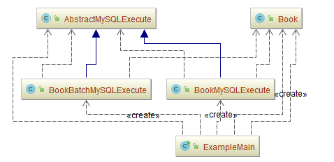
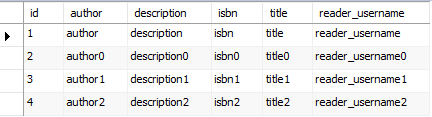

## 模板方法模式（Template Method）

### 意图
定义一个操作中的算法的骨架，而将一些步骤延迟到子类中。

`Template Method` 使得子类可以不改变一个算法的结构即可重定义该算法的某些特定步骤。

### 适用性
模板方法应用于下列情况：
-	一次性实现一个算法的不变的部分，并将可变的行为留给子类来实现。
-	各子类中公共的行为应被提取出来并集中到一个公共父类中以避免代码重复。首先识别现有代码中的不同之处，并且将不同之处分离为新的操作。最后，用一个调用这些新的操作的模板方法来替换这些不同的代码。
-	控制子类扩展。模板方法只在特定点调用“hook”操作（参见效果一节），这样就只允许在这些点进行扩展。
### 参与者
-	**Abstract Class**（抽象类角色）
	-	定义抽象的原语操作（primitiveoperation），具体的子类将重定义它们以实现一个算法的各步骤。
	-	实现一个模板方法,定义一个算法的骨架。该模板方法不仅调用原语操作，也调用定义在AbstractClass或其他对象中的操作。
-	**Concrete Class**（具体类角色）
	-	实现原语操作以完成算法中与特定子类相关的步骤。
### 协作
-	ConcreteClass靠AbstractClass来实现算法中不变的步骤。

### 示例一：通用源代码

-	[AbstractClass.java](Pattern510_TemplateMethod/src/main/java/com/jueee/example01/AbstractClass.java)（抽象类角色）
-	[ContreteTemplateA.java](Pattern510_TemplateMethod/src/main/java/com/jueee/example01/ContreteTemplateA.java)、[ContreteTemplateB.java](Pattern510_TemplateMethod/src/main/java/com/jueee/example01/ContreteTemplateB.java)（具体类角色）
-	[ExampleMain.java](Pattern510_TemplateMethod/src/main/java/com/jueee/example01/ExampleMain.java)（测试类）

### 示例二：插入MySQL数据库通用模板

-	[AbstractMySQLExecute.java](Pattern510_TemplateMethod/src/main/java/com/jueee/example02/AbstractMySQLExecute.java)（抽象类角色）
-	[BookBatchMySQLExecute.java](Pattern510_TemplateMethod/src/main/java/com/jueee/example02/BookBatchMySQLExecute.java)、[BookMySQLExecute.java](Pattern510_TemplateMethod/src/main/java/com/jueee/example02/BookMySQLExecute.java)（具体类角色）
-	[ExampleMain.java](Pattern510_TemplateMethod/src/main/java/com/jueee/example02/ExampleMain.java)（测试类）
-	[Book.java](Pattern510_TemplateMethod/src/main/java/com/jueee/example02/Book.java)（数据库表对象的 Bean 类）
-	[Book.sql](Pattern510_TemplateMethod/src/main/java/com/jueee/example02/Book.sql)（建表脚本）

运行结果：

