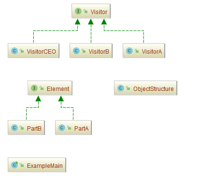
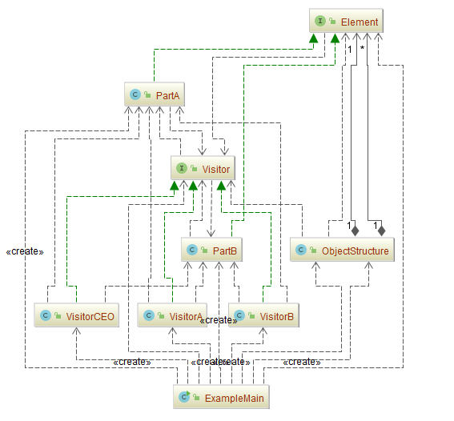

## 访问者模式（Visitor）

### 意图
表示一个作用于某对象结构中的各元素的操作。

Visitor 模式使你可以在不改变各元素的类的前提下定义作用于这些元素的新操作。

### 适用性
在下列情况下使用 Visitor 模式：
-	一个对象结构包含很多类对象，它们有不同的接口，而你想对这些对象实施一些依赖于其具体类的操作。
-	需要对一个对象结构中的对象进行很多不同的并且不相关的操作，而你想避免让这些操作“污染”这些对象的类。Visitor 使得你可以将相关的操作集中起来定义在一个类中。当该对象结构被很多应用共享时，用Visitor模式让每个应用仅包含需要用到的操作。
-	定义对象结构的类很少改变，但经常需要在此结构上定义新的操作。改变对象结构类需要重定义对所有访问者的接口，这可能需要很大的代价。如果对象结构类经常改变，那么可能还是在这些类中定义这些操作较好。

### 参与者
-	**Visitor**（抽象访问者角色）
	-	为该对象结构中ConcreteElement的每一个类声明一个Visit操作。该操作的名字和特征标识了发送Visit请求给该访问者的那个类。这使得访问者可以确定正被访问元素的具体的类。这样访问者就可以通过该元素的特定接口直接访问它。
-	**ConcreteVisitor**（具体访问者角色）
	-	实现每个由Visitor声明的操作。每个操作实现本算法的一部分，而该算法片断乃是对应于结构中对象的类。ConcreteVisitor为该算法提供了上下文并存储它的局部状态。这一状态常常在遍历该结构的过程中累积结果。
-	**Element**（抽象元素角色）
	-	定义一个Accept操作，它以一个访问者为参数。
-	**ConcreteElement**（具体元素角色）
	-	实现Accept操作，该操作以一个访问者为参数。
-	**ObjectStructure**（对象结构角色）
	-	能枚举它的元素。
	-	可以提供一个高层的接口以允许该访问者访问它的元素。
	-	可以是一个复合或是一个集合，如一个列表或一个无序集合。

### 协作
-	一个使用Visitor模式的客户必须创建一个ConcreteVisitor对象，然后遍历该对象结构，并用该访问者访问每一个元素。
-	当一个元素被访问时，它调用对应于它的类的Visitor操作。如果必要，该元素将自身作为这个操作的一个参数以便该访问者访问它的状态。

### 效果
下面是访问者模式的一些优缺点：
- **访问者模式使得易于增加新的操作**

  访问者使得增加依赖于复杂对象结构的构件的操作变得容易了。仅需增加一个新的访问者即可在一个对象结构上定义一个新的操作。相反，如果每个功能都分散在多个类之上的话，定义新的操作时必须修改每一类。

- **访问者集中相关的操作而分离无关的操作**

  相关的行为不是分布在定义该对象结构的各个类上，而是集中在一个访问者中。无关行为却被分别放在它们各自的访问者子类中。这就既简化了这些元素的类，也简化了在这些访问者中定义的算法。所有与它的算法相关的数据结构都可以被隐藏在访问者中。

- **增加新的 ConcreteElement 类很困难**

  Visitor 模式使得难以增加新的Element的子类。每添加一个新的ConcreteElement都要在Vistor中添加一个新的抽象操作，并在每一个ConcretVisitor类中实现相应的操作。

- **通过类层次进行访问**

  一个迭代器可以通过调用节点对象的特定操作来遍历整个对象结构，同时访问这些对象。但是迭代器不能对具有不同元素类型的对象结构进行操作。

- **累积状态**

  当访问者访问对象结构中的每一个元素时，它可能会累积状态。如果没有访问者，这一状态将作为额外的参数传递给进行遍历的操作，或者定义为全局变量。

- **破坏封装**

  访问者方法假定 ConcreteElement 接口的功能足够强，足以让访问者进行它们的工作。结果是，该模式常常迫使你提供访问元素内部状态的公共操作，这可能会破坏它的封装性。

### 示例一：通用源代码（双重分派）

数据结构的每一个节点都可以接受一个访问者的调用，此节点向访问者对象传入节点对象，而访问者则反过来执行节点对象的操作。这样的过程叫做 “**双重分派**”。节点调用访问者，将它自己传入，访问者则将某种算法针对此节点执行。

-	[Visitor.java](Pattern511_Visitor/src/main/java/com/jueee/example01/Visitor.java)（抽象访问者角色）
-	[VisitorA.java](Pattern511_Visitor/src/main/java/com/jueee/example01/VisitorA.java)、[VisitorB.java](Pattern511_Visitor/src/main/java/com/jueee/example01/VisitorB.java)、[VisitorCEO.java](Pattern511_Visitor/src/main/java/com/jueee/example01/VisitorCEO.java)（具体访问者角色）
-	[Element.java](Pattern511_Visitor/src/main/java/com/jueee/example01/Element.java)（抽象元素角色）
-	[PartA.java](Pattern511_Visitor/src/main/java/com/jueee/example01/PartA.java)、[PartB.java](Pattern511_Visitor/src/main/java/com/jueee/example01/PartB.java)（具体元素角色）
-	[ObjectStructure.java](Pattern511_Visitor/src/main/java/com/jueee/example01/ObjectStructure.java)（对象结构角色）
-	[ExampleMain.java](Pattern511_Visitor/src/main/java/com/jueee/example01/ExampleMain.java)（测试类）

