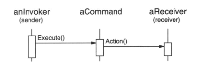
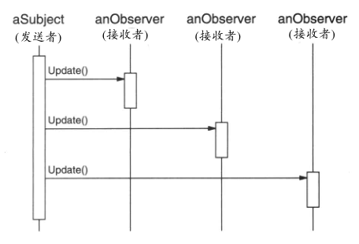
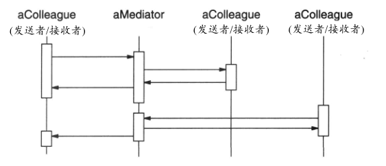
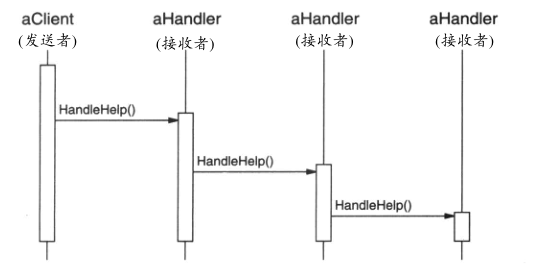

## 行为模式的讨论

### 封装变化
封装变化是很多行为模式的主题。

当一个程序的某个方面的特征经常发生改变时，这些模式就定义一个封装这个方面的对象。这样当该程序的其他部分依赖于这个方面时，它们都可以与此对象协作。

这些模式通常定义一个抽象类来描述这些封装变化的对象，并且通常该模式依据这个对象来命名。

例如：

-	[策略模式（Strategy）](5.09策略模式（Strategy）.md)：一个 Strategy 对象封装一个算法。
-	[状态模式（State）](5.08状态模式（State）.md)：一个 State 对象封装一个与状态相关的行为。
-	[中介者模式（Mediator）](5.05中介者模式（Mediator）.md)：一个 Mediator 对象封装对象间的协议。
-	[迭代器模式（Iterator）](5.04迭代器模式（Iterator）.md)：一个 Iterator 对象封装访问和遍历一个聚集对象中的各个构件的方法。

这些模式描述了程序中很可能会改变的方面。

大多数模式有两种对象：

- **封装该方面特征的新对象**
- **使用这些新的对象的已有对象**

如果不使用这些模式的话，通常这些新对象的功能就会变成这些已有对象的难以分割的一部分。

例如，一个 Strategy 的代码可能会被嵌入到其 Context 类中，而一个 State 的代码可能会在该状态的 Context 类中直接实现。

但不是所有的对象行为模式都象这样分割功能。

例如，[责任链模式（ChainOfResponsibility）](5.01责任链模式（ChainOfResponsibility）.md)可以处理任意数目的对象（即一个链），而所有这些对象可能已经存在于系统中了。职责链说明了行为模式间的另一个不同点：并非所有的行为模式都定义类之间的静态通信关系。职责链提供在数目可变的对象间进行通信的机制。其他模式涉及到一些作为参数传递的对象。

### 对象作为参数
一些模式引入总是被用作参数的对象。

例如 [访问者模式（Visitor）](5.11访问者模式（Visitor）.md)。一个 Visitor 对象是一个多态的 Accept 操作的参数，这个操作作用于该 Visitor 对象访问的对象。虽然以前通常代替 Visitor 模式的方法是将 Visitor 代码分布在一些对象结构的类中，但 visitor 从来都不是它所访问的对象的一部分。

其他模式定义一些可作为令牌到处传递的对象，这些对象将在稍后被调用。[命令模式（Command）](5.02命令模式（Command）.md)和 [备忘录模式（Memento）](5.06备忘录模式（Memento）.md)都属于这一类。在Command中，令牌代表一个请求；而在Memento中，它代表在一个对象在某个特定时刻的内部状态。在这两种情况下，令牌都可以有一个复杂的内部表示，但客户并不会意识到这一点。但这里还有一些区别：在Command模式中多态很重要，因为执行Command对象是一个多态的操作。相反，Memento接口非常小，以至于备忘录只能作为一个值传递。因此它很可能根本不给它的客户提供任何多态操作。

### 通信应该被封装还是被分布
[中介者模式（Mediator）](5.05中介者模式（Mediator）.md) 和 [观察者模式（Observer）](5.07观察者模式（Observer）.md)是相互竞争的模式。

它们之间的差别是：

- **Observer**通过引入Observer和Subject对象来分布通信。
- **Mediator**对象则封装了其他对象间的通信。

在Observer模式中，不存在封装一个约束的单个对象，而必须是由Observer和Subject对象相互协作来维护这个约束。

通信模式由观察者和目标连接的方式决定：一个目标通常有多个观察者，并且有时一个目标的观察者也是另一个观察者的目标。

Mediator模式的目的是集中而不是分布。它将维护一个约束的职责直接放在一个中介者中。我们发现生成可复用的Observer和Subject比生成可复用的Mediator容易一些。

Observer模式有利于Observer和Subject间的分割和松耦合，同时这将产生粒度更细,从而更易于复用的类。

另一方面，相对于Observer，Mediator中的通信流更容易理解。观察者和目标通常在它们被创建后很快即被连接起来，并且很难看出此后它们在程序中是如何连接的。

### 对发送者和接收者解耦
当合作的对象直接互相引用时，它们变得互相依赖，这可能会对一个系统的分层和重用性产生负面影响。

[命令模式（Command）](5.02命令模式（Command）.md)、[观察者模式（Observer）](5.07观察者模式（Observer）.md)、[中介者模式（Mediator）](5.05中介者模式（Mediator）.md)，和[责任链模式（ChainOfResponsibility）](5.01责任链模式（ChainOfResponsibility）.md)等模式都涉及如何对发送者和接收者解耦，但它们又各有不同的权衡考虑。

#### 命令模式

[命令模式（Command）](5.02命令模式（Command）.md)使用一个Command对象来定义一个发送者和一个接收者之间的绑定关系，从而支持解耦，如下图所示。

Command对象提供了一个提交请求的简单接口（即Execute操作）。将发送者和接收者之间的连接定义在一个单独的对象使得该发送者可以与不同的接收者一起工作。这就将发送者与接收者解耦，使发送者更易于复用。此外，可以复用Command对象，用不同的发送者参数化一个接收者。虽然Command模式描述了避免使用生成子类的实现技术，名义上每一个发送者－接收者连接都需要一个子类。

#### 观察者模式

[观察者模式（Observer）](5.07观察者模式（Observer）.md)通过定义一个接口来通知目标中发生的改变，从而将发送者（目标）与接收者（观察者）解耦。Observer定义了一个比Command更松的发送者－接收者绑定，因为一个目标可能有多个观察者，并且其数目可以在运行时变化，如下图所示。

观察者模式中的Subject和Observer接口是为了处理Subject的变化而设计的，因此当对象间有数据依赖时，最好用观察者模式来对它们进行解耦。

#### 中介者模式

[中介者模式（Mediator）](5.05中介者模式（Mediator）.md)让对象通过一个Mediator对象间接的互相引用，从而对它们解耦，如下图所示。

一个Mediator对象为各Colleague对象间的请求提供路由并集中它们的通信。因此各Colleague对象仅能通过Mediator接口相互交谈。因为这个接口是固定的，为增加灵活性Mediator可能不得不实现它自己的分发策略。可以用一定方式对请求编码并打包参数，使得Colleague对象可以请求的操作数目不限。

中介者模式可以减少一个系统中的子类生成，因为它将通信行为集中到一个类中而不是将其分布在各个子类中。然而，特别的分发策略通常会降低类型安全性。

#### 责任链模式

[责任链模式（ChainOfResponsibility）](5.01责任链模式（ChainOfResponsibility）.md)通过沿一个潜在接收者链传递请求而将发送者与接收者解耦，如下图所示。

因为发送者和接收者之间的接口是固定的，职责链可能也需要一个定制的分发策略。因此它与Mediator一样存在类型安全的问题。如果职责链已经是系统结构的一部分，同时在链上的多个对象中总有一个可以处理请求，那么职责链将是一个很好的将发送者和接收者解耦的方法。此外，因为链可以被简单的改变和扩展，从而该模式提供了更大的灵活性。

### 总结
除了少数例外情况，各个行为设计模式之间是相互补充和相互加强的关系。

例如，一个职责链中的类可能包括至少一个 [模板方法模式（TemplateMethod）](5.10模板方法模式（TemplateMethod）.md)的应用。该模板方法可使用原语操作确定该对象是否应处理该请求并选择应转发的对象。职责链可以使用 [命令模式（Command）](5.02命令模式（Command）.md)将请求表示为对象。

[解释器模式（Interpreter）](5.03解释器模式（Interpreter）.md)可以使用 [状态模式（State）](5.08状态模式（State）.md)定义语法分析上下文。迭代器可以遍历一个聚合，而访问者可以对它的每一个元素进行一个操作。

行为模式也与能其他模式很好地协同工作。

例如，一个使用 [组合模式（Composite）](../ch04StructuralPatterns/4.3组合模式（Composite）.md)的系统可以使用一个访问者对该复合的各成分进行一些操作：

- 它可以使用职责链使得各成分可以通过它们的父类访问某些全局属性。
- 它可以使用 [装饰模式（Decorator）](../ch04StructuralPatterns/4.4装饰模式（Decorator）.md) 对该复合的某些部分的这些属性进行改写。
- 它可以使用 [观察者模式（Observer）](5.07观察者模式（Observer）.md)将一个对象结构与另一个对象结构联系起来。
- 可以使用 [状态模式（State）](5.08状态模式（State）.md)使得一个构件在状态改变时可以改变自身的行为。
- 复合本身可以使用 [生成器（Builder）](../ch03CreationalPatterns/3.2生成器（Builder）.md)中的方法创建，并且它可以被系统中的其他部分当作一个 [原型模式（Prototype）](../ch03CreationalPatterns/3.4原型模式（Prototype）.md)。

设计良好的面向对象式系统通常有多个模式镶嵌在其中，但其设计者却未必使用这些术语进行思考。

然而，在模式级别而不是在类或对象级别上的进行系统组装可以使我们更方便地获取同等的协同性。